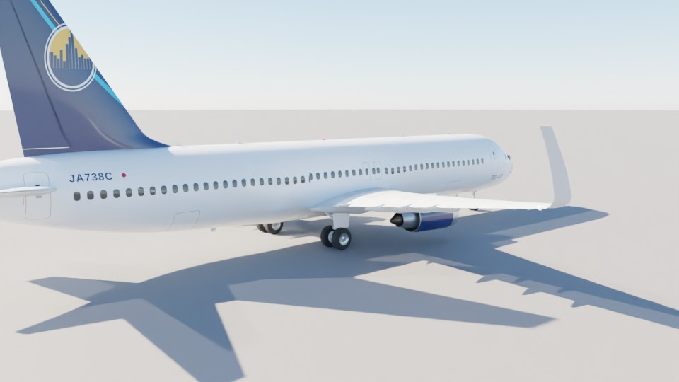
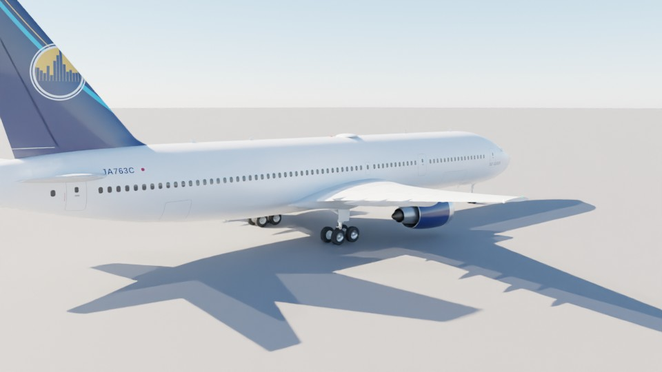

# Micomsoft Fright Simulator — Blender で作る 787-9 / 767-300ER / 737-800 と空港・都市

Boeing 787-9 を **Blender (Python / bpy) で寸法どおりに数値モデリング**し、空港と都市も同じく Blender で生成して、
ブラウザで飛ばせる **6 自由度フライトシミュレーター**にしたプロジェクトです。


| | |
|---|---|
|  |  |
|  |  |

| 737-800 | 767-300ER |
|---|---|
|  |  |

## すぐに遊ぶ / Quick start

```bash
cd b787-flight-sim/web
python3 -m http.server 8000
# ブラウザで http://localhost:8000 を開く
```

WebGL2 対応ブラウザ（Chrome / Edge / Firefox / Safari 最新版）で動きます。three.js は `web/vendor/` に同梱しているのでオフラインでも動作します。

## 中身 / What's inside

### 1. Boeing 787-9（`blender/build_b787.py`）
公開寸法（[docs/SPECS.md](docs/SPECS.md)）から全ての形状を数式で生成しています。

* **寸法**：全長 62.81 m・全幅 60.12 m・全高 17.02 m・胴体 5.77 × 5.97 m・翼面積 376.6 m²（公表 377 m²）・¼弦後退角 32°・ホイールベース 25.83 m・トレッド 9.80 m
* **胴体**：断面スーパー楕円のロフト（約 300 ステーション）。787 特有の丸い機首、ベリーフェアリング、テールコーンの跳ね上げ、APU 排気口
* **主翼**：CST 法の超臨界翼型、翼厚・ねじり下げの翼幅分布、6° 上反角と緩やかな上向き湾曲、レイクド・ウイングチップ
* **可動翼**（それぞれ独立オブジェクト、ヒンジ軸 = ローカル X）：内側/外側ドロップヒンジ・フラップ、フラッペロン、エルロン、スポイラー 7 枚 × 2、スラット 6 枚 × 2、全遊動水平安定板、エレベーター、ラダー、フラップトラック・フェアリング
* **GEnx-1B エンジン**：ファン径 2.82 m、18 枚のスイープ付きワイドコード・ファン、白いスパイラル入りスピナー、OGV、**18 枚のシェブロン**付きファンノズル、コアカウル・プラグ、パイロン、ナセル・ストレーキ
* **降着装置**：前脚 2 輪・主脚 4 輪ボギー（タイヤ・ホイール・ブレーキ・トルクリンク・ブレース）、格納アニメーション用のピボット、脚扉
* **灯火**：航法灯・ストロボ・ビーコン・着陸灯・ターンオフ灯・ロゴ灯
* **コックピット内部（`blender/cockpit_b787.py`）**：パネルはすべて「テクスチャ付きパネル」方式。パネルごとに実際の 787 風のアートワーク（パネルグレー・刻印の区画線・白い文字・ノブの目盛・LCD 窓）と、夜間に光る文字のエミッションマップを生成し、3D の操作部品を同じ位置に配置（押しボタンの天面はアートワークに UV マッピングされ「FAULT/OFF」「PRESS」「ON BAT」などの表示がボタン自体に出る）
  * オーバーヘッドパネル：IRS・飛行操縦・電源（GEN CTRL・BUS TIE・バックアップ発電機）・油圧・APU・エンジン始動・燃料ポンプ/クロスフィード/ジェティソン・防氷・乗客サイン・消火ハンドル・空調・与圧・貨物室消火・外部灯火・ワイパーなど 35 区画
  * MCP：シミュレーター内でライブ描画（速度・方位・V/S・高度の窓、LNAV/VNAV/FLCH/A/P/HOLD/LOC/APP のモードバーがオートフライトと連動、夜は文字が発光）。EFIS パネル、マスター WARNING/CAUTION
  * 計器盤：5 面ディスプレイ（PFD/ND/EICAS がリアルタイム表示）とベゼル・ボタン、スタンバイ計器、時計、脚レバー、オートブレーキ、表示切替
  * ペデスタル：文字入りキーの CDU ×2、T 字グリップのスラストレバー（逆噴射レバー付き）、スピードブレーキ/フラップのゲートと目盛、燃料制御スイッチ、パーキングブレーキ、スタブトリム・カットアウト、VHF/トランスポンダー/オーディオパネル、トリム
  * 操縦輪（ラムズホーン形・グリップ・PTT/トリムスイッチ・チェックリストクリップ）、ラダーペダル、ティラー、酸素マスク箱、EFB、ヘッドセット、送風口、パイロットシート（シープスキン・ハーネス）、後方隔壁のサーキットブレーカーパネル・コックピットドア・オブザーバー席、ドームライト
  * 明るいグレーの内装ライニング、昼は窓からの光・夜は暗いフラッドライトで室内を照明
* **塗装**：8K の胴体テクスチャを機体座標で描画（窓・ドア・貨物ドア・コックピット窓・パネルライン法線マップ・夜間の客室灯）。登録記号 JA787C
* **リアル描画**：HDR レンダリング（4x MSAA）→ HDR クランプ → ブルーム（夜は灯火がにじむ）→ エンジン排気の陽炎（N1 に比例、画面空間の屈折）→ ACES トーンマッピング → レンズ（周辺減光・色収差・フィルムグレイン）。Cycles でベイクしたアンビエントオクルージョン（胴体・主翼、`--bake`）、クリアコート塗装、物理的な減衰の着陸灯・タキシー灯、滑走路の接地帯のタイヤ痕・舗装目地・骨材の粒感（シェーダー）、地上滑走・接地・バフェットでのカメラ振動（`web/js/postfx.js`）
* **機内（Blender）**：`blender/cabin_b787.py` で内装を生成し `b787-9-cabin.glb` に出力（機内視点に入ったときに読み込み）。窓の開口部とリビール、オーバーヘッドビン、ドロップ天井とムードライト、カーペット、ギャレー 4 か所、ラバトリー 7 か所（便器・洗面台・鏡。1 か所はドアを開けて中が見える）、クラス仕切り、ドア、非常口サイン。座席はビジネス 2-2-2 ×30・プレミアムエコノミー 2-3-2 ×28・エコノミー 3-3-3 ×251（尾部の絞り込みで外側席を自動削減）の計 309 席。座席と乗客は GPU インスタンシングで描画し、座席の布地色は塗装に連動
* **乗客**：ペイロード ÷ 100 kg（手荷物込み）の人数を座席にランダムに着席させる（体格・肌・髪・服の色がばらばら）。メニューの重量欄に人数を表示
* **乗客のモーション**（`web/js/cabinlife.js`）：乗客は頭・上腕・前腕を関節ごとに動かすパーツ構成（Blender で部位ごとに出力）。一人ひとりがランダムに「周りを見る・窓の外を見る・スマホ・読書・居眠り（首をかしげる）・隣と会話（身振り付き）・伸び・頭をかく・飲み物・モニター視聴・ひじ掛け」を切り替え、機内食が来ると食事（フォークを口へ運ぶ）をする
* **機内食サービス**：高度 10,000 ft を超えると（または **O** キー）客室乗務員 2 名がギャレーカートを押して各通路を前方から後方へ進み、列ごとに停止して体を向け腕を伸ばしてトレイを手渡す（トレイテーブルに料理・カップ・パンが並ぶ）。食事時間のあとトレイを回収。乗務員の制服は塗装の色。787・767 は 2 通路、737 は 1 通路で同時進行
* **機内エンタメ（IFE）**（`web/js/ife.js`）：全座席の背面モニターがそれぞれ別のチャンネルを表示（マップ・フライト情報・映画 4 本・音楽・ゲーム・ニュース、空席はウェルカム画面）。視点 **「座席モニター」**（C で切替）では自分の席のモニターを操作でき、ライブの**ムービングマップ**（通過した航跡・目的地までの距離・高度・外気温）、**フライト情報**、映画「空の旅」「海の物語」「夜の街」「宇宙ねこ」（字幕・再生バー付きのアニメーション）、音楽ビジュアライザー、ニュース、**機外カメラ**（垂直尾翼の上からの実映像）、◀ ▶ で遊べるゲーム「スターキャッチ」を選べる
* **エアライン塗装（実在 17 社）**：メニューの「機体塗装 / Livery」で JAL・ANA・Peach・Jetstar Japan・American・Delta・United・British Airways・Lufthansa・Air France・KLM・Emirates・Qatar Airways・Singapore Airlines・Cathay Pacific・Korean Air・Qantas から選択。各社の尾翼マーク・胴体タイトル（ワードマーク）・胴体下部とラインの色・尾翼の色・エンジンの色を塗り分け、設定はブラウザに保存。胴体塗装とタイトルはシェーダーで機体座標から描画（`web/js/livery.js`）。AI 機もこの 17 社からランダム（呼出符号は各社の実際のもの：Japan Air・Speedbird・Airfrans など、出発案内板の便名は IATA コード）
* 出力：`blender/output/b787-9.blend`（テクスチャ埋め込み）、`web/assets/b787-9.glb`（Draco 圧縮）、駐機用 LOD `b787-9-lod.glb`

### 1b. Boeing 737-800 / 767-300ER（同じ `build_b787.py`、`AC_TYPE=b738` / `b763`）
* 787-9 と同じ手順（数式による形状 → テクスチャ → Blender → glTF）で生成。寸法・重量・エンジンは [docs/SPECS.md](docs/SPECS.md)
* 737-800：ブレンデッド・ウイングレット、CFM56-7B（下面の平らなナセル・24 枚ファン・シェブロン無し）、単軸 2 輪の主脚（脚扉無し）、長いドーサルフィン、翼上非常口、3-3 の単通路客室 164 席
* 767-300ER：CF6-80C2（38 枚ファン）、4 輪ボギー、翼上非常口、2-3-2 の双通路客室 240 席
* 機種ごとに：塗装レイアウト（胴体ライン・タイトル・尾翼ロゴ）、登録記号 JA738C / JA763C、客室、LOD、飛行性能（翼面積・重量・推力・Mmo）、エンジン音（ファン枚数と回転数）
* コックピット内装は 787 のレイアウトを機首に合わせて縮尺した近似です
* AI 交通の機種は毎回ランダム（3 機種が偏らないようシャッフルした順に割り当て）（767・787 は無線で "heavy" を付けて交信）。駐機位置は機種ごとに前脚の停止位置をそろえ、ケータリング車・ベルトローダー・給油車・タグの位置もドアと貨物ドアの位置から決定

### 2. 空港と都市（`blender/build_world.py`）
* **シティビルダー国際空港 (RJCB)**：滑走路 09/27（3,500 × 60 m、ICAO 標示：ピアノキー・指示標識・接地帯・目標点・中心線・縁線）、平行誘導路・高速脱出誘導路、ホールディングポジション、エプロン、**14 スポットのボーディングブリッジ**付きターミナル、管制塔、整備ハンガー、貨物地区、燃料タンク、消防署、駐車場、ホテル、ILS（ローカライザー・グライドスロープ）、PAPI、進入灯
* **詳細な空港建築キット（`blender/airport_kit.py`）**：両空港のターミナル・ブリッジ・管制塔・格納庫はこのキットで生成。カーテンウォール（方立・無目・床スラブ）、エプロン階のシャッター付きサービスフロア、ウェーブ屋根と庇の柱、屋上設備。**ボーディングブリッジ**は固定通路 → 支柱付きロタンダ → 2 段の伸縮トンネル（窓帯・リブ）→ 車輪付き駆動脚 → 機体ドアに向いたキャブ（蛇腹）と点検階段まで作り込み、各スポットの 787 L1 ドアに接続。ゲート階段室・駐機誘導表示板（VDGS）・ゲート番号、管制塔（事務棟・リブ付きシャフト・傾斜ガラスの八角形キャブ・キャットウォーク・アンテナ・レドーム）、格納庫（かまぼこ屋根（リブ・換気塔）・分割扉・事務棟）。空港名は建物に焼き込まず、書き出したアンカー位置にシミュレーターが描画
* **都市**：約 6,000 棟の建物（高層ビルはセットバック・円筒・スラブ型、屋上設備、航空障害灯）、道路網と街路灯、公園と 3.4 万本の樹木（インスタンシング）、川と橋、斜張橋、高さ 450 m の電波塔、コンテナ港とガントリークレーン
* 灯火データ（滑走路灯・誘導路灯・進入灯の連鎖フラッシャー・**見る角度で色が変わる PAPI**・街路灯）を `world.json` に出力

### 2b. 地方空港 3 か所（`blender/build_airport2.py --id 2|3|4`）
* 3,000 m 滑走路 09/27（ICAO 標示・滑走路灯・中心線灯・進入灯・連鎖フラッシャー・PAPI）、平行誘導路と 3 本の取付誘導路（誘導路灯・停止線灯・案内標識）、7 スポット（B1–B7）すべてにボーディングブリッジ、ゲートピアとランドサイドのメインホール、管制塔、整備格納庫、消防署、貨物上屋、立体駐車場、投光照明塔、吹流し、ILS ローカライザー/グライドスロープ、ブラストフェンス、空港外周フェンス
* ランドサイド：出発車寄せ・中央分離帯（バス／タクシー乗り場の上屋・並木）・駐車場を囲む周回道路・町へのアクセス道路・平面駐車場と立体駐車場の駐車車両・街路灯
* 周囲の町（約 5,000 棟、街路・街灯・並木、進入経路の下は空ける）
* 第2空港（東へ約 200 km）・第3空港（西へ約 180 km）・第4空港（東へ約 300 km）：同じ規模の空港設計で、周囲の町は空港ごとに別（配置・中心・密度）。スポット番号は B / C / D
* 出力：`web/assets/airportN.glb` と、スポット・看板位置・灯火・当たり判定・樹木の `airportN.json`（各空港の中心を原点とする座標、配置は `web/js/airports.js`）。モデルはカメラが 70 km 以内に近づいたときに読み込み

### 3. 地上支援車両（`blender/build_gse.py`）
* 10 車種：トーバーレス・プッシュバックタグ、手荷物トーイングトラクター、ULD ドーリー＋LD3 コンテナ、幌付き手荷物カート、ベルトローダー（ベルトが貨物ドアの高さまで上昇）、ケータリング車（シザーリフトで荷台が上昇し前部プラットフォームが展開）、給油車（JET A-1 タンク、昇降デッキ）、FOLLOW ME カー（点灯サイン）、運航用バン、ランプバス
* タイヤは個別オブジェクトで回転・前輪が操舵、回転灯・前照灯・尾灯が点灯
* 出力：`web/assets/gse.glb` と寸法・連結点の `gse.json`

### 4. 空港の交通と管制（`web/js/traffic.js`, `path.js`, `atc.js`）
* **駐機機が管制の指示で飛ぶ**：Ground にプッシュバックを要求 → 許可後にタグが前脚をくわえてプッシュバック（エンジン始動）→ 「滑走路 27 の停止位置まで Alpha 経由でタキシー」→ 停止線で待機 → Tower の「滑走路に入って待機」「離陸許可」→ 離陸・脚上げ → 場周経路（アップウインド・クロスウインド・ダウンウインド・ベース・ファイナル、バンク角は速度と旋回半径から計算）→ 着陸許可 → 3° のパスで進入・フレア・接地（タイヤスモーク）→ 誘導路へ離脱 → Ground の指示でスポットへ → 到着後にターンアラウンド → 次のフライトへ
* **管制の判断**：滑走路の占有（AI 機・プレイヤー機）、着陸機の到着予定時刻による離陸待機、前の着陸機との間隔によるダウンウインド延長、滑走路が空かなければゴーアラウンド、エプロン誘導路は 1 機ずつ（到着機優先）。無線のやりとりは画面左に表示し、英語の音声で読み上げ（送信の開始・終了のスケルチ音と帯域を絞ったガリガリ雑音を Web Audio で重ねて VHF 無線風に。Web Speech API、メニューまたは 9 キーで ON/OFF）
* **地上車両が自律走行**：両端の車両置き場から左側通行のサービス道路を走り、到着機にベルトローダー・手荷物カート列・ULD 列・ケータリング車・給油車が順に横付けして作業（リフト上昇など）、終わるとバックして離れ車庫に戻る。牽引カートは連結点に追従（トレーラー軌跡）。前方の車両や動いている航空機を検知して減速・停止
* プレイヤー機も障害物・滑走路占有として扱われる（滑走路上にいれば AI は待機・ゴーアラウンド）
* 使用滑走路は風向で決定（27 / 09）。**B キー**で AI 機・車両を追いかけるカメラ（押すたびに対象切替）、メニューで交通の ON/OFF

### 5. フライトシミュレーター（`web/`）
* **6 自由度剛体（240 Hz 固定ステップ）**：迎角/横滑り角・マッハ・地面効果・フラップ/スポイラー/脚の空力、失速と失速後特性、ISA 大気
* **GEnx-1B エンジン**：N1 スプール遅れ、推力の高度・マッハ減衰、逆噴射、燃料消費
* **降着装置**：ばね・ダンパー、タイヤ摩擦、ブレーキ（アンチスキッド相当）、前輪ステアリング、プッシュバック
* **フライ・バイ・ワイヤ**（787 風）：飛行経路角保持＋オートトリム、ロールレート指令＋バンク保持、エンベロープ保護（失速・過速・バンク・ピッチ）、ヨーダンパー、推力非対称補償
* **オートパイロット/オートスロットル**：HDG / ALT / V/S / FLCH / LOC / G/S、**オートランド（フレア・RETARD・ロールアウト）**、オートブレーキ、グラウンドスポイラー
* **グラスコックピット**：PFD・ND・EICAS、共形 HUD（FPV・ピッチラダー・ILS）、MCP パネル
* **警報とコールアウト**：V1・ROTATE・電波高度（2500〜10）・MINIMUMS・RETARD・GPWS（SINK RATE / PULL UP / TOO LOW GEAR…）・スティックシェイカー・オーバースピード・A/P 解除音
* **描画**：大気散乱の空と太陽の日周運動、環境マップ反射、影、GPU 地形（物理と同一の高さ関数）、波のある海と川、雲（晴れ〜曇天・雨）、**ボリュメトリック雲**（高品質時：3D Perlin-Worley ノイズのレイマーチ、多重散乱・前方散乱、深度を考慮した合成、曇天時は切れ目のない雲底と雲中の視程低下 — `web/js/clouds.js`）、**雨**（カメラ相対速度で傾く雨筋、窓ガラスの水滴が速度で後方へ流れる、雨音）、**濡れた滑走路**（水たまり・鏡面反射・灯火の縦長の映り込み、タイヤとエンジン後流の水しぶき、制動力低下、降り止んだ後は徐々に乾く）、**翼端渦・フラップ端渦とオーバーウイング・ベイパー**（湿度・迎角・フラップ・速度に応じて発生 — `web/js/vapor.js`）、夜の街明かり、**主翼のたわみ（揚力に応じて翼端が数 m しなる）**、タイヤスモーク、飛行機雲
* **損傷と火災**（`flightmodel.js`, `mishap.js`, `fx.js`）：主翼・エンジン・尾翼・胴体の各部位が地面/建物（`world.json` の障害物ボックス）との接触を個別に判定。ぶつけた場所が欠損（シェーダーで切り落とし、破片が飛ぶ）または炎上し、火災ベル・マスターウォーニング・EICAS 表示が作動。揚力/ロール/抗力/安定性/推力の非対称と燃料漏れが飛行特性に反映され、Shift+X で消火。
* **緊急事態（メーデー / パンパン）**（`playeratc.js`, `emergency.js`）：損傷・故障があると ATC ボタン（Y）が「メーデー宣言 / パンパン宣言」になり、宣言すると管制官が応答（スコーク 7700・最終進入へのレーダー誘導・即時着陸許可）、全局に「緊急事態発生・出発機は待機」を放送し、AI 機の離陸と着陸を止めて滑走路を空けます。飛行中の空港の消防署から赤い空港化学消防車 3 台（点滅灯つき）が滑走路脇の接地帯で待機、着陸後は機体を追って周囲を囲み、放水で火災を消します（約 15 秒）。火が消えて 45 秒後に「安全確認・滑走路再開」。宣言しないまま損傷があると 20 秒後に管制が「緊急事態を宣言しますか？」と確認、他空港に向かうと宣言が引き継がれ、主翼損傷や両発停止で低高度になると客室に「頭を下げて！」。**訓練用の故障**：Shift+E（ランダム）または一時停止画面のボタン（エンジン火災 / エンジン停止 / 燃料漏れ）。**全自動緊急着陸**：宣言後にもう一度 Y（または Shift+L）で、乗員が最寄り空港の使用滑走路へ全自動で着陸（`AutoFlight.emergency`：エンジン火災チェックリストで消火、滑走路の手前に居れば直接 ILS、通り過ぎていればダウンウインド経由で 45° 会合、周辺の山は予測経路の地形から最低安全高度を計算して回避、主翼損傷時は最小操縦速度・フラップ制限・バンク 12° 制限・長めのファイナル・最大オートブレーキ）。メニューの自動操縦フライト中に故障が起きると乗員が自動で宣言して最寄り空港へ引き返します。**建物への衝突**：飛行中に翼端・エンジン・尾翼が建物に当たると（胴体が当たれば墜落）数秒で管制が「建物への衝突を確認、緊急事態を宣言しますか？」と呼び掛け、地上走行中に建物に接触するとグラウンドが停止を指示して消防車が点検に来ます。空港内（5 km 以内）で墜落した場合はクラッシュアラームが放送され、消防車が残骸へ急行して放水します。**AI 機の緊急事態**：時々到着機がパンパンを宣言（エンジン故障・油圧故障・客室の煙・バードストライク・急病人）して優先着陸し、同じく消防車が出動します。
* **墜落演出**：爆発・火球（光は数秒かけて膨らみ消える、画面の点滅や暗転・墜落メッセージは無し。Esc でやり直し/メニュー）、胴体が前/中/後部に分断され主翼・エンジン・脚・尾翼がばらばらに飛び散り（剛体運動・地面バウンド）、各破片と燃料プールが炎上・黒煙を上げる。海では水蒸気。
* **表面の質感**（`shading.js`）：機体の汚れ・筋状の汚れ・艶のムラ・排気のすす、地上車両の泥はね・塗装剥げ、ビルの外壁ごとの色差・雨だれ・足元の汚れ・夜間の窓の点灯のばらつき、市外の畑・生け垣のパッチワーク。
* **ロゴの出典**：npm パッケージ `@steyng/airline-logos`（Soaring Symbols）の SVG をアートワークに合わせて切り抜き（`web/js/airlinelogos.js`, `airlinelogos2.js`）。商標・著作権は各航空会社に帰属。
* **プッシュバック**：J で最寄りの GSE 基地から黄色いトーイングカーが前脚まで来て連結 → 押し出し（Q/E で操向）→ もう一度 J で切り離し、トーイングカーは基地へ戻る。JAL 塗装では押し出し開始と同時に全座席モニターで機内安全ビデオを音付きで上映（`assets/jal_safety.mp4` / `.webm`）。音は客室内で最大、コックピットではわずか、機外ではこもって聞こえ、カメラが約 80 m 離れると聞こえなくなる。
* **地方空港 3 か所と往復便**（`web/js/airports.js`, `airport2.js`, `traffic.js`）：AI 機は出発のたびに 3 空港からランダムに目的地を選び（出発案内板にも表示）、巡航して着陸 → スポットへ地上走行 → 駐機・地上サービス → プッシュバック → 離陸して戻り、ホーム空港に直線進入で着陸。地方空港では出発空港側から進入する向きの滑走路（東の空港は 09、西の空港は 27）を離着陸とも使用します。
* **地方空港の地上車両・管制・町**：各空港に車両基地（トーイングカー・ケータリング・給油車・ベルトローダー）があり、駐機した AI 機へサービスに向かい、出発前にはトーイングカーがプッシュバック。各空港の Tower / Ground との交信（着陸許可・地上走行・プッシュバック・離陸許可）。周囲には約 5,000 棟の町（街路・街灯・当たり判定付き、進入経路の下は空けてある）。
* **空港ごとに独立した無線**：4 空港それぞれに別の Tower / Ground。無線は自機に最も近い空港の周波数に切り替わり（切替時に通知）、その空港の管制と交通だけが聞こえます。プレイヤーの要求（プッシュバック・タキシー・離陸・着陸・スポットへ）も、その空港の滑走路・誘導路（地方空港は Bravo）・スポット・交通状況で処理され、地方空港でプレイヤーが滑走路の許可を得ている間は AI 機が離陸を待ちます。
* **出発案内板**（Shift+D または右上のボタン）：成田空港風の黒い出発案内（時刻・行先・便名・搭乗口・備考、日本語と英語が数秒ごとに切り替わる、航空会社マーク付き）。4 空港をタブで切替。AI 機の実際の駐機・出発状況から生成されます。
* **自動プッシュバック**（`web/js/pushback.js`）：J を押すとトーイングカーが連結し、機体を押し出して誘導路（タキシーレーン）に沿う向きまで自動で回し、止まって切り離し。P でブレーキ解除して地上走行へ。
* **機内を歩く**：視点「機内を歩く Walk」で WASD / 矢印で移動、Q/E で向き、ドラッグで見回し、Shift で早歩き。通路・ギャレーは自由に、座席の列は通り抜けられません。
* **無線ノイズ**：フライト設定で ON/OFF。
* **空港名と目的地**：フライト設定で 4 空港の名前と目的地を設定。空港名はターミナル・格納庫の看板、ATC の呼出し（◯◯ Tower / Ground）、出発案内板、機内マップ、**地上車両の社名表示**（◯◯ GROUND SERVICES・給油車・ケータリング車、空港ごと）に反映。目的地は機内エンタメの地図（出発地・目的地・残り距離）、自動操縦フライト、目的地ファイナルのシナリオに使われます。
* **自動操縦フライト**（シナリオ「自動操縦フライト」、`web/js/autoflight.js`）：出発空港の使用滑走路から目的地まで全自動。離陸（フラップ 5・離陸推力・センターライン維持・VR で機首上げ・ギア上げ）→ 800 ft で A/P・A/T → 経路に沿って上昇（フラップ格納、10,000 ft 以下 250 kt）→ 距離に応じた巡航高度 → 降下開始点から 3,000 ft へ降下（減速・フラップ）→ 進入フィックスで ILS（LOC/GS 捕捉、ギア・フラップ 30、Vref+5）→ 自動着陸 → 逆噴射・オートブレーキで停止。操縦桿を動かすと手動に切り替わります（`tests/autoflight_test.mjs` で全経路を検証）。
* **建物の当たり判定**：ビル・ターミナル・格納庫・燃料タンク・管制塔・橋の主塔・港のクレーン等（`world.json` の障害物ボックス）。低速で当てると停止して損傷表示、速度があれば欠損・炎上・墜落。
* **視点**：コックピット（HUD）・追尾・外部・客室窓（窓側座席から翼のたわみが見える）・機内（通路）・管制塔・フライバイ・AI 交通（B で対象切替）
* **タイトル画面**：キービジュアル（`web/assets/title.jpg`）にロゴ・キャッチコピー・特長・スタートボタン。クリック / Enter / Space でメニューへ
* **メニュー**：3 ステップのスライド式（黒と砂色のデザイン）— ① フライト設定（シナリオ・交通・音声・画質）→ ② 機体設定（737-800 / 767-300ER / 787-9 の切替、燃料・ペイロード、塗装）→ ③ 環境設定（時刻・天候・風・乱気流）→ 飛行開始。タッチ操作ではスワイプで切替
* **シナリオ**：RWY27/09 離陸、ゲート 7 からプッシュバック、ILS 27 進入、ショートファイナル手動着陸、目的地ファイナル、自動操縦フライト、都市遊覧、FL350 巡航

## 操作 / Controls

| キー | 操作 | キー | 操作 |
|---|---|---|---|
| ↑ ↓ / W S | ピッチ（↓=機首上げ） | ← → / A D | ロール（地上では前輪操舵） |
| Q E | ラダー・前輪 | R F | 推力 +/− |
| Shift+R | TOGA | Shift+F | アイドル |
| H | 逆噴射（地上） | X / Z | フラップ下げ / 上げ |
| G | ギア | / または K | スピードブレーキ（DOWN→ARMED→FLIGHT→UP） |
| Space / . | ブレーキ | P | パーキングブレーキ |
| N | オートブレーキ | J | プッシュバック |
| 1 / 2 | A/P / A/T | 3 4 5 7 | HDG / ALT / V/S / FLCH |
| 6 | APP（ILS 捕捉を準備） | 0 | DIRECT 則（Home/End でトリム） |
| C | 視点切替 | I / U | 計器パネル / HUD |
| L | 着陸灯 | T | 時刻 +1 時間 |
| B | AI 交通カメラ（対象切替） | 9 | ATC 音声 ON/OFF |
| O | 地上サービス | Shift+X | 消火（火災ハンドル） |
| Shift+E | 故障発生（緊急訓練） | Y（損傷時） | メーデー / パンパン宣言 → 再度 Y で全自動緊急着陸 |
| Shift+L | 全自動緊急着陸 | | |
| Shift+D | 出発案内板 | 視点 Walk で WASD | 機内を歩く |
| Esc | 一時停止（操作方法を表示）/ 再開 | Backspace | リセット |

MCP の数値（IAS / HDG / V/S / ALT）はマウスホイールで変更、クリックで現在値に合わせます（Shift で 10 倍）。ゲームパッドにも対応しています。

**離陸のコツ**：Shift+R → VR（PFD 速度テープの緑の VR）で ↓ を 2〜3 秒 → 機首 12〜15° を保持 → 正の上昇率で G → 1000 ft 以上で 1 を押して A/P。
**着陸のコツ**：ILS シナリオで 6（APP）→ ギア G、フラップを 30 まで X で下げ、A/T の速度を Vref+5 に。50 ft で自動フレア、接地後は H で逆噴射。

## ビルド / Rebuild the Blender assets

```bash
pip install bpy pillow scipy numpy      # または Blender 4.x/5.x 同梱の Python
cd b787-flight-sim/blender
python3 build_b787.py                   # 787-9（テクスチャ生成 → .blend → .glb）
python3 build_b787.py --quick --lod     # 駐機機用 LOD
AC_TYPE=b738 python3 build_b787.py      # 737-800（--lod も同様）
AC_TYPE=b763 python3 build_b787.py      # 767-300ER
python3 build_world.py                  # 空港＋都市
python3 build_airport2.py --id 2         # 地方空港（--id 3 / 4 も）＋周囲の町
python3 build_gse.py                    # 地上支援車両
python3 render_previews.py aircraft     # Cycles プレビュー（docs/images）
python3 render_previews.py world
```

Blender アプリから使う場合：`blender --background --python build_b787.py`。

## 単一 HTML 版 / Single-file build

```bash
npm i esbuild                       # 初回のみ
python3 tools/build_single_html.py --video-kbps 56   # → dist/MicomsoftFrightSimulator.html（約 31 MB）
```
JavaScript（three.js 含む）を esbuild で 1 本にまとめ、モデル・データ・テクスチャ・安全ビデオ・Draco デコーダーをすべて base64 で埋め込んだ 1 ファイル。サイズを抑えるため、圧縮の効くものは gzip、地方空港モデルのテクスチャは world.glb と同じ画像なので除いて実行時に共有、4096 px を超える機体テクスチャは半分に縮小・JPEG 再圧縮、安全ビデオは `--video-kbps` で再エンコード（imageio-ffmpeg または ffmpeg）、`--no-video` で省略。サーバー不要で、ダブルクリックでブラウザ（Chrome / Edge / Firefox）で開けます。起動時に埋め込みデータをメモリ上の blob URL に展開し（`window.B787_ASSETS`）、`main.js` が fetch と three.js のローダーをそこへ振り向けます。

## テスト / Tests

```bash
node tests/flight_test.mjs
node tests/autoflight_test.mjs        # 自動操縦フライト 全経路
node tests/emergency_land_test.mjs    # 緊急自動着陸 6 位置 × 3 故障（AC=b737-800 / b767-300er も可）
```
離陸・A/P 高度/方位/速度保持・FL350 巡航・ILS オートランド、自動操縦フライト、緊急自動着陸をグラフィック無しで検証します。

## ファイル構成 / Layout

```
b787-flight-sim/
├── blender/
│   ├── b787_geometry.py      787-9 / 767-300ER / 737-800 の寸法と形状関数（AC_TYPE で切替）
│   ├── build_b787.py         機体モデル生成（bpy）
│   ├── textures_b787.py      塗装・窓・パネルライン等のテクスチャ生成
│   ├── cockpit_b787.py       コックピットのパネル・スイッチ・座席（テクスチャ付きパネル）
│   ├── cabin_b787.py         客室
│   ├── build_gse.py          地上支援車両（タグ・給油車・ケータリング車など）
│   ├── build_world.py        空港・都市生成（bpy）
│   ├── airport_kit.py        空港建築キット（ターミナル・ボーディングブリッジ・管制塔・格納庫など）
│   ├── build_airport2.py     地方空港（--id 2/3/4）と周囲の町（bpy）
│   ├── textures_world.py     アスファルト・ファサード等のタイルテクスチャ
│   ├── render_previews.py    Cycles によるプレビューレンダリング
│   └── output/*.blend        Blender で開けるシーン（テクスチャ埋め込み）
├── web/                      シミュレーター（index.html + js/ + assets/ + vendor/three）
├── tests/flight_test.mjs     飛行モデルの自動テスト
└── docs/                     SPECS.md（寸法と出典）、images/
```

寸法と出典は [docs/SPECS.md](docs/SPECS.md) を参照してください。登録記号・空港は架空のものです。エアラインのロゴと塗装は実在各社のもので、権利は各社に帰属します。
