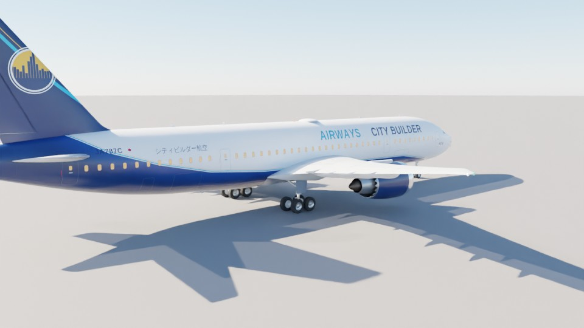
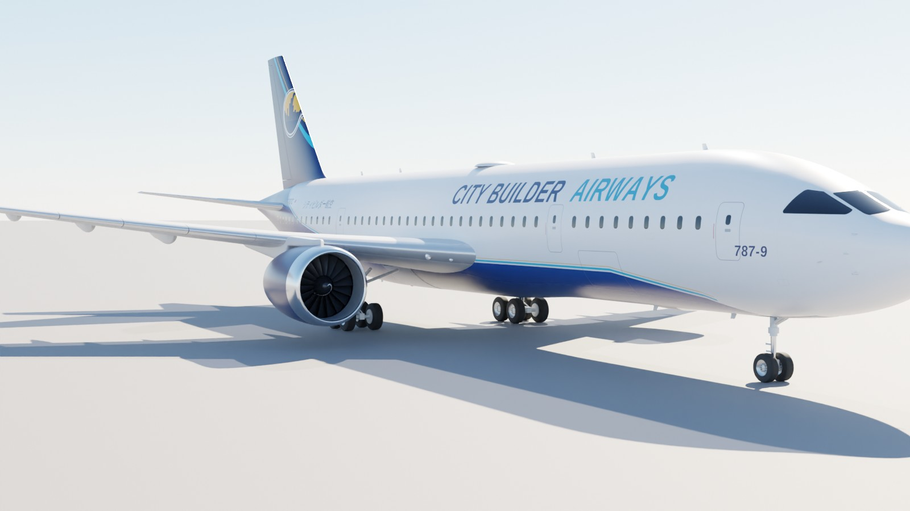
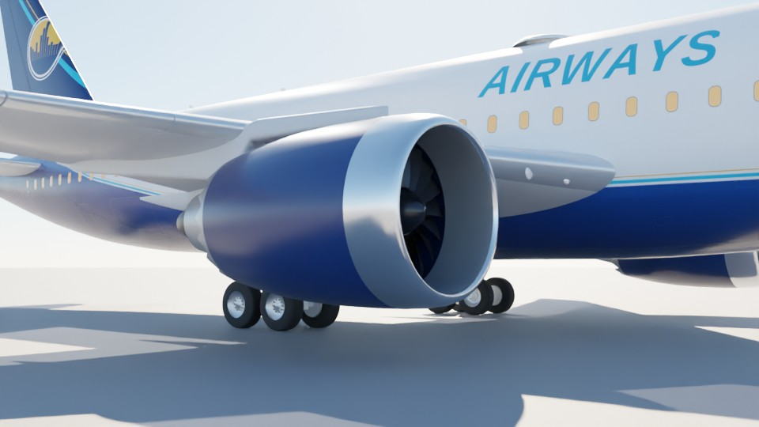
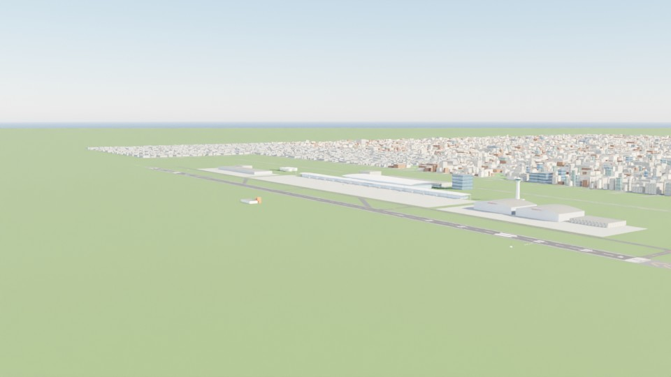
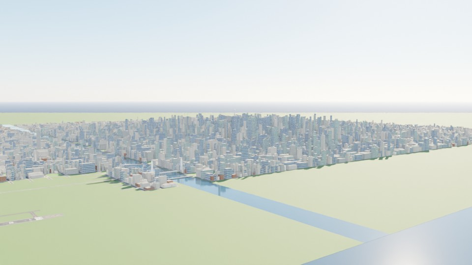

# B787-9 Flight Simulator — Blender で作る 787-9 と空港・都市

Boeing 787-9 を **Blender (Python / bpy) で寸法どおりに数値モデリング**し、空港と都市も同じく Blender で生成して、
ブラウザで飛ばせる **6 自由度フライトシミュレーター**にしたプロジェクトです。



| | |
|---|---|
|  |  |
|  |  |

## すぐに遊ぶ / Quick start

```bash
cd b787-flight-sim/web
python3 -m http.server 8000
# ブラウザで http://localhost:8000 を開く
```

WebGL2 対応ブラウザ（Chrome / Edge / Firefox / Safari 最新版）で動きます。three.js は `web/vendor/` に同梱しているのでオフラインでも動作します。

## 中身 / What's inside

### 1. Boeing 787-9（`blender/build_b787.py`）
公開寸法（[docs/SPECS.md](docs/SPECS.md)）から全ての形状を数式で生成しています。

* **寸法**：全長 62.81 m・全幅 60.12 m・全高 17.02 m・胴体 5.77 × 5.97 m・翼面積 376.6 m²（公表 377 m²）・¼弦後退角 32°・ホイールベース 25.83 m・トレッド 9.80 m
* **胴体**：断面スーパー楕円のロフト（約 300 ステーション）。787 特有の丸い機首、ベリーフェアリング、テールコーンの跳ね上げ、APU 排気口
* **主翼**：CST 法の超臨界翼型、翼厚・ねじり下げの翼幅分布、6° 上反角と緩やかな上向き湾曲、レイクド・ウイングチップ
* **可動翼**（それぞれ独立オブジェクト、ヒンジ軸 = ローカル X）：内側/外側ドロップヒンジ・フラップ、フラッペロン、エルロン、スポイラー 7 枚 × 2、スラット 6 枚 × 2、全遊動水平安定板、エレベーター、ラダー、フラップトラック・フェアリング
* **GEnx-1B エンジン**：ファン径 2.82 m、18 枚のスイープ付きワイドコード・ファン、白いスパイラル入りスピナー、OGV、**18 枚のシェブロン**付きファンノズル、コアカウル・プラグ、パイロン、ナセル・ストレーキ
* **降着装置**：前脚 2 輪・主脚 4 輪ボギー（タイヤ・ホイール・ブレーキ・トルクリンク・ブレース）、格納アニメーション用のピボット、脚扉
* **灯火**：航法灯・ストロボ・ビーコン・着陸灯・ターンオフ灯・ロゴ灯
* **コックピット内部**：5 面の大型ディスプレイ（シム内の計器がリアルタイムに表示）、HUD コンバイナー、スラストレバー、操縦輪、座席
* **塗装**：8K の胴体テクスチャを機体座標で描画（窓・ドア・貨物ドア・コックピット窓・パネルライン法線マップ・夜間の客室灯）。登録記号 JA787C
* **カスタム塗装**：メニューの「機体塗装 / Livery」でエアライン名（既定 **Claude Air**）とロゴ 7 種（スパーク・鶴・スカイライン・波・富士・地球・紙飛行機）を選択。ロゴごとに胴体下部・ピンストライプ・垂直尾翼・エンジンの配色が変わり、設定はブラウザに保存。胴体塗装とタイトルはシェーダーで機体座標から描画（`web/js/livery.js`, `web/assets/livery.json`）。駐機機はランダムな塗装
* 出力：`blender/output/b787-9.blend`（テクスチャ埋め込み）、`web/assets/b787-9.glb`（Draco 圧縮）、駐機用 LOD `b787-9-lod.glb`

### 2. 空港と都市（`blender/build_world.py`）
* **シティビルダー国際空港 (RJCB)**：滑走路 09/27（3,500 × 60 m、ICAO 標示：ピアノキー・指示標識・接地帯・目標点・中心線・縁線）、平行誘導路・高速脱出誘導路、ホールディングポジション、エプロン、**14 スポットのボーディングブリッジ**付きターミナル、管制塔、整備ハンガー、貨物地区、燃料タンク、消防署、駐車場、ホテル、ILS（ローカライザー・グライドスロープ）、PAPI、進入灯
* **都市**：約 6,000 棟の建物（高層ビルはセットバック・円筒・スラブ型、屋上設備、航空障害灯）、道路網と街路灯、公園と 3.4 万本の樹木（インスタンシング）、川と橋、斜張橋、高さ 450 m の電波塔、コンテナ港とガントリークレーン
* 灯火データ（滑走路灯・誘導路灯・進入灯の連鎖フラッシャー・**見る角度で色が変わる PAPI**・街路灯）を `world.json` に出力

### 3. フライトシミュレーター（`web/`）
* **6 自由度剛体（240 Hz 固定ステップ）**：迎角/横滑り角・マッハ・地面効果・フラップ/スポイラー/脚の空力、失速と失速後特性、ISA 大気
* **GEnx-1B エンジン**：N1 スプール遅れ、推力の高度・マッハ減衰、逆噴射、燃料消費
* **降着装置**：ばね・ダンパー、タイヤ摩擦、ブレーキ（アンチスキッド相当）、前輪ステアリング、プッシュバック
* **フライ・バイ・ワイヤ**（787 風）：飛行経路角保持＋オートトリム、ロールレート指令＋バンク保持、エンベロープ保護（失速・過速・バンク・ピッチ）、ヨーダンパー、推力非対称補償
* **オートパイロット/オートスロットル**：HDG / ALT / V/S / FLCH / LOC / G/S、**オートランド（フレア・RETARD・ロールアウト）**、オートブレーキ、グラウンドスポイラー
* **グラスコックピット**：PFD・ND・EICAS、共形 HUD（FPV・ピッチラダー・ILS）、MCP パネル
* **警報とコールアウト**：V1・ROTATE・電波高度（2500〜10）・MINIMUMS・RETARD・GPWS（SINK RATE / PULL UP / TOO LOW GEAR…）・スティックシェイカー・オーバースピード・A/P 解除音
* **描画**：大気散乱の空と太陽の日周運動、環境マップ反射、影、GPU 地形（物理と同一の高さ関数）、波のある海と川、雲（晴れ〜曇天）、夜の街明かり、**主翼のたわみ（揚力に応じて翼端が数 m しなる）**、タイヤスモーク、飛行機雲
* **視点**：コックピット（HUD）・追尾・外部・客室窓（翼のたわみが見える）・管制塔・フライバイ
* **シナリオ**：RWY27/09 離陸、ゲート 7 からプッシュバック、ILS 27 進入、ショートファイナル手動着陸、都市遊覧、FL350 巡航

## 操作 / Controls

| キー | 操作 | キー | 操作 |
|---|---|---|---|
| ↑ ↓ / W S | ピッチ（↓=機首上げ） | ← → / A D | ロール（地上では前輪操舵） |
| Q E | ラダー・前輪 | R F | 推力 +/− |
| Shift+R | TOGA | Shift+F | アイドル |
| H | 逆噴射（地上） | X / Z | フラップ下げ / 上げ |
| G | ギア | / または K | スピードブレーキ（DOWN→ARMED→FLIGHT→UP） |
| Space / . | ブレーキ | P | パーキングブレーキ |
| N | オートブレーキ | J | プッシュバック |
| 1 / 2 | A/P / A/T | 3 4 5 7 | HDG / ALT / V/S / FLCH |
| 6 | APP（ILS 捕捉を準備） | 0 | DIRECT 則（Home/End でトリム） |
| C | 視点切替 | I / U | 計器パネル / HUD |
| L | 着陸灯 | T | 時刻 +1 時間 |
| Esc | 一時停止（操作方法を表示）/ 再開 | Backspace | リセット |

MCP の数値（IAS / HDG / V/S / ALT）はマウスホイールで変更、クリックで現在値に合わせます（Shift で 10 倍）。ゲームパッドにも対応しています。

**離陸のコツ**：Shift+R → VR（PFD 速度テープの緑の VR）で ↓ を 2〜3 秒 → 機首 12〜15° を保持 → 正の上昇率で G → 1000 ft 以上で 1 を押して A/P。
**着陸のコツ**：ILS シナリオで 6（APP）→ ギア G、フラップを 30 まで X で下げ、A/T の速度を Vref+5 に。50 ft で自動フレア、接地後は H で逆噴射。

## ビルド / Rebuild the Blender assets

```bash
pip install bpy pillow scipy numpy      # または Blender 4.x/5.x 同梱の Python
cd b787-flight-sim/blender
python3 build_b787.py                   # 787-9（テクスチャ生成 → .blend → .glb）
python3 build_b787.py --quick --lod     # 駐機機用 LOD
python3 build_world.py                  # 空港＋都市
python3 render_previews.py aircraft     # Cycles プレビュー（docs/images）
python3 render_previews.py world
```

Blender アプリから使う場合：`blender --background --python build_b787.py`。

## テスト / Tests

```bash
node tests/flight_test.mjs
```
離陸・A/P 高度/方位/速度保持・FL350 巡航・ILS オートランドをグラフィック無しで検証します。

## ファイル構成 / Layout

```
b787-flight-sim/
├── blender/
│   ├── b787_geometry.py      787-9 の寸法と形状関数（胴体・翼型・平面形・尾翼・エンジン）
│   ├── build_b787.py         機体モデル生成（bpy）
│   ├── textures_b787.py      塗装・窓・パネルライン等のテクスチャ生成
│   ├── build_world.py        空港・都市生成（bpy）
│   ├── textures_world.py     アスファルト・ファサード等のタイルテクスチャ
│   ├── render_previews.py    Cycles によるプレビューレンダリング
│   └── output/*.blend        Blender で開けるシーン（テクスチャ埋め込み）
├── web/                      シミュレーター（index.html + js/ + assets/ + vendor/three）
├── tests/flight_test.mjs     飛行モデルの自動テスト
└── docs/                     SPECS.md（寸法と出典）、images/
```

寸法と出典は [docs/SPECS.md](docs/SPECS.md) を参照してください。塗装・航空会社名・登録記号は架空のものです。
