# Micomsoft Fright Simulator — Blender で作る 787-9 / 767-300ER / 737-800 / 747-400 / ATR 72-600、オリジナル機 MA-300 / 700 / 900 と空港・都市

Boeing 787-9 を **Blender (Python / bpy) で寸法どおりに数値モデリング**し、空港と都市も同じく Blender で生成して、
ブラウザで飛ばせる **6 自由度フライトシミュレーター**にしたプロジェクトです。

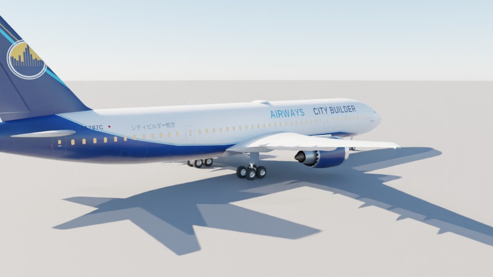

| | |
|---|---|
| 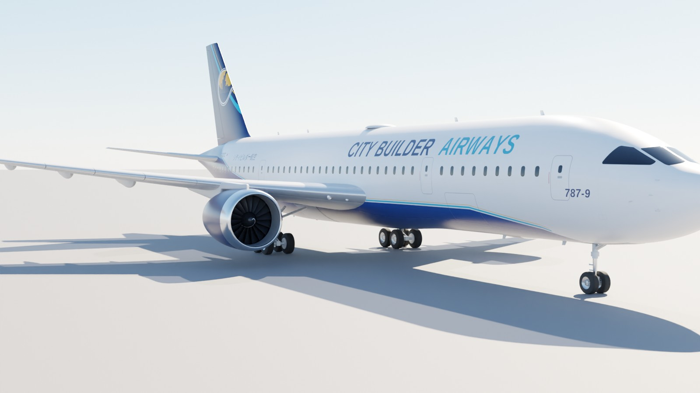 | 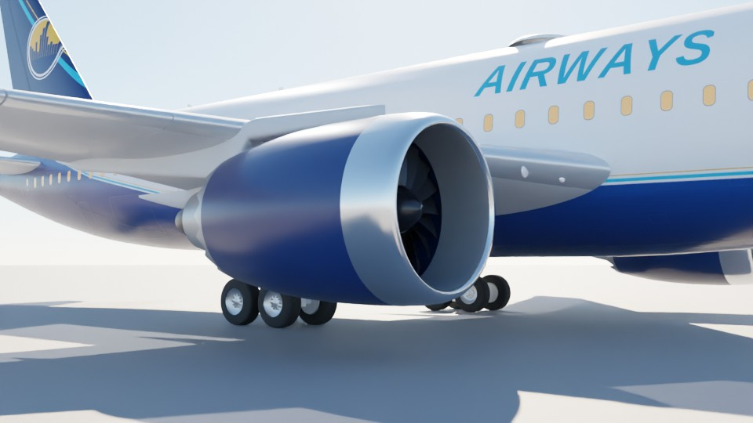 |
| 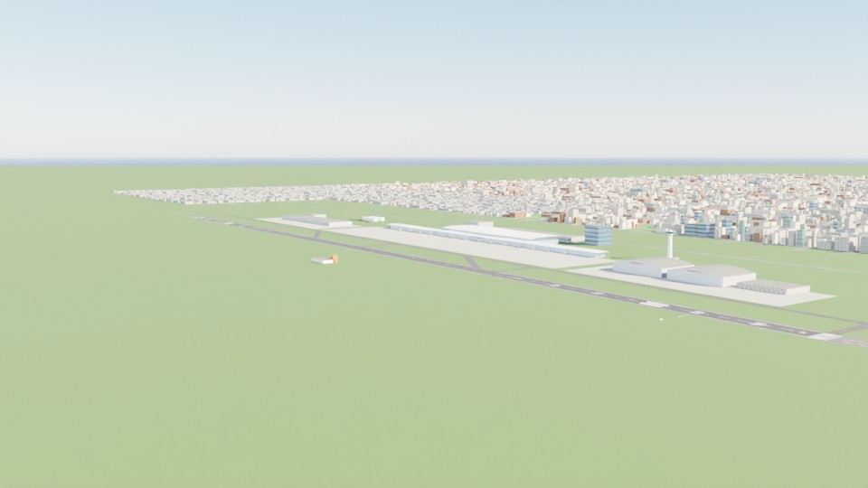 | 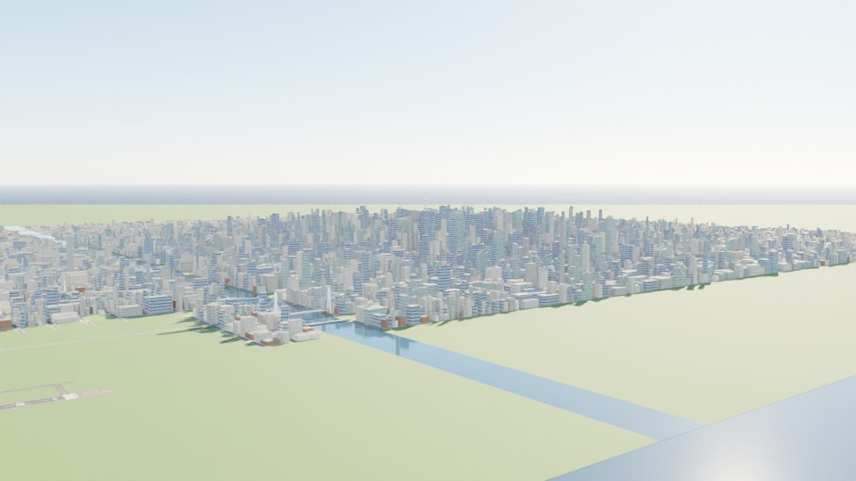 |

| 737-800 | 767-300ER |
|---|---|
| 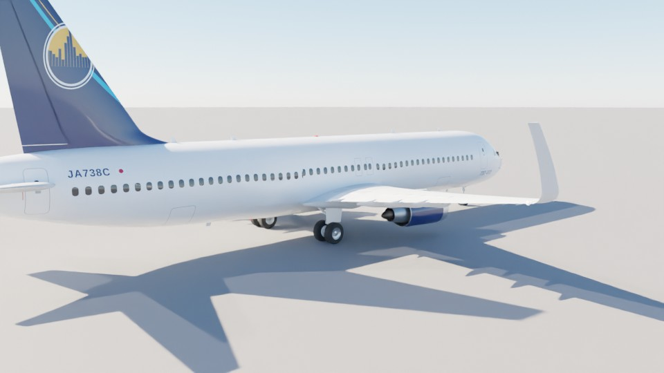 | 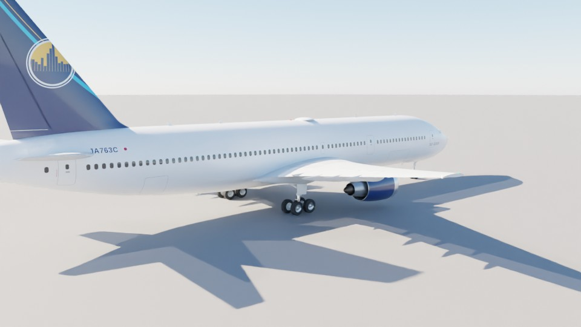 |
| **747-400** | **ATR 72-600** |
| 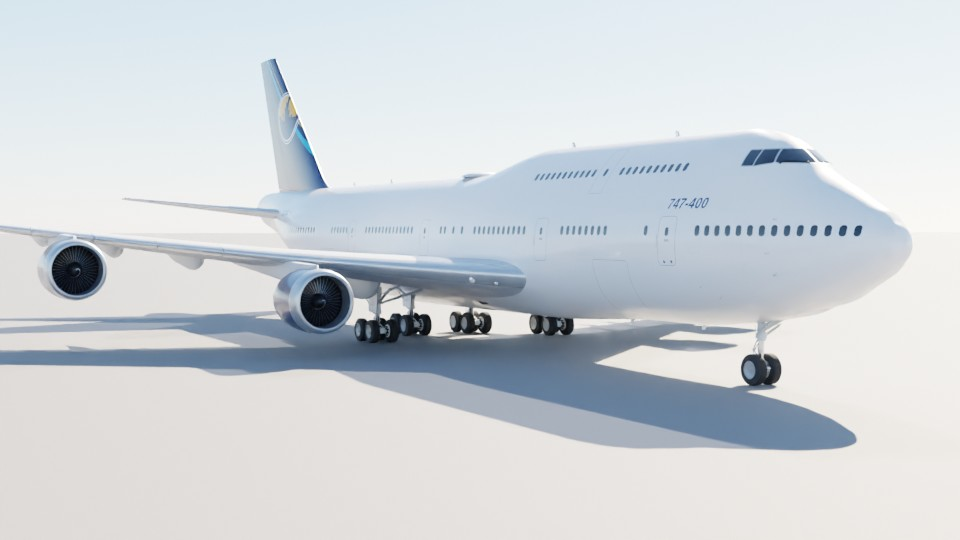 | 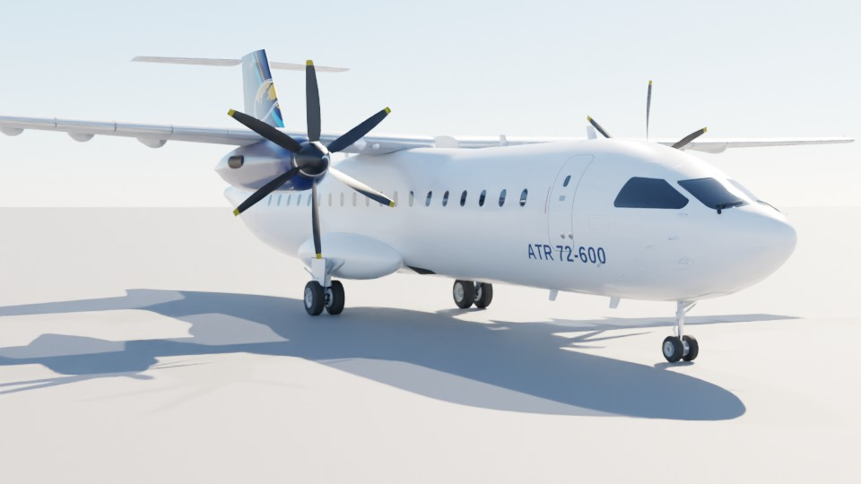 |

## すぐに遊ぶ / Quick start

```bash
cd b787-flight-sim/web
python3 -m http.server 8000
# ブラウザで http://localhost:8000 を開く
```

WebGL2 対応ブラウザ（Chrome / Edge / Firefox / Safari 最新版）で動きます。three.js は `web/vendor/` に同梱しているのでオフラインでも動作します。

## 中身 / What's inside

### 1. Boeing 787-9（`blender/build_b787.py`）
公開寸法（[docs/SPECS.md](docs/SPECS.md)）から全ての形状を数式で生成しています。

* **寸法**：全長 62.81 m・全幅 60.12 m・全高 17.02 m・胴体 5.77 × 5.97 m・翼面積 376.6 m²（公表 377 m²）・¼弦後退角 32°・ホイールベース 25.83 m・トレッド 9.80 m
* **胴体**：断面スーパー楕円のロフト（約 300 ステーション）。787 特有の丸い機首、ベリーフェアリング、テールコーンの跳ね上げ、APU 排気口
* **主翼**：CST 法の超臨界翼型、翼厚・ねじり下げの翼幅分布、6° 上反角と緩やかな上向き湾曲、レイクド・ウイングチップ
* **可動翼**（それぞれ独立オブジェクト、ヒンジ軸 = ローカル X）：内側/外側ドロップヒンジ・フラップ、フラッペロン、エルロン、スポイラー 7 枚 × 2、スラット 6 枚 × 2、全遊動水平安定板、エレベーター、ラダー、フラップトラック・フェアリング
* **GEnx-1B エンジン**：ファン径 2.82 m、18 枚のスイープ付きワイドコード・ファン、白いスパイラル入りスピナー、OGV、**18 枚のシェブロン**付きファンノズル、コアカウル・プラグ、パイロン、ナセル・ストレーキ
* **降着装置**：前脚 2 輪・主脚 4 輪ボギー（タイヤ・ホイール・ブレーキ・トルクリンク・ブレース）、格納アニメーション用のピボット、脚扉
* **灯火**：航法灯・ストロボ・ビーコン・着陸灯・ターンオフ灯・ロゴ灯
* **コックピット内部（`blender/cockpit_b787.py`）**：パネルはすべて「テクスチャ付きパネル」方式。パネルごとに実際の 787 風のアートワーク（パネルグレー・刻印の区画線・白い文字・ノブの目盛・LCD 窓）と、夜間に光る文字のエミッションマップを生成し、3D の操作部品を同じ位置に配置（押しボタンの天面はアートワークに UV マッピングされ「FAULT/OFF」「PRESS」「ON BAT」などの表示がボタン自体に出る）
  * オーバーヘッドパネル：IRS・飛行操縦・電源（GEN CTRL・BUS TIE・バックアップ発電機）・油圧・APU・エンジン始動・燃料ポンプ/クロスフィード/ジェティソン・防氷・乗客サイン・消火ハンドル・空調・与圧・貨物室消火・外部灯火・ワイパーなど 35 区画
  * MCP：シミュレーター内でライブ描画（速度・方位・V/S・高度の窓、LNAV/VNAV/FLCH/A/P/HOLD/LOC/APP のモードバーがオートフライトと連動、夜は文字が発光）。EFIS パネル、マスター WARNING/CAUTION
  * 計器盤：5 面ディスプレイ（PFD/ND/EICAS がリアルタイム表示）とベゼル・ボタン、スタンバイ計器、時計、脚レバー、オートブレーキ、表示切替
  * ペデスタル：文字入りキーの CDU ×2、T 字グリップのスラストレバー（逆噴射レバー付き）、スピードブレーキ/フラップのゲートと目盛、燃料制御スイッチ、パーキングブレーキ、スタブトリム・カットアウト、VHF/トランスポンダー/オーディオパネル、トリム
  * 操縦輪（ラムズホーン形・グリップ・PTT/トリムスイッチ・チェックリストクリップ）、ラダーペダル、ティラー、酸素マスク箱、EFB、ヘッドセット、送風口、パイロットシート（シープスキン・ハーネス）、後方隔壁のサーキットブレーカーパネル・コックピットドア・オブザーバー席、ドームライト
  * 明るいグレーの内装ライニング、昼は窓からの光・夜は暗いフラッドライトで室内を照明
* **塗装**：8K の胴体テクスチャを機体座標で描画（窓・ドア・貨物ドア・コックピット窓・パネルライン法線マップ・夜間の客室灯）。登録記号 JA787C
* **リアル描画**：HDR レンダリング（4x MSAA）→ HDR クランプ → ブルーム（夜は灯火がにじむ）→ エンジン排気の陽炎（N1 に比例、画面空間の屈折）→ ACES トーンマッピング → レンズ（周辺減光・色収差・フィルムグレイン）。Cycles でベイクしたアンビエントオクルージョン（胴体・主翼、`--bake`）、クリアコート塗装、物理的な減衰の着陸灯・タキシー灯、滑走路の接地帯のタイヤ痕・舗装目地・骨材の粒感（シェーダー）、地上滑走・接地・バフェットでのカメラ振動（`web/js/postfx.js`）
* **画質「異次元 Ultra」**（既定）：深度から計算する SSAO（ギアの下・ボーディングブリッジ・ビルの谷間の接地影、半解像度＋深度考慮アップサンプル）、太陽の光芒（ゴッドレイ：雲の切れ間や建物で遮られた光の筋）、レンズフレア（ゴースト・色分散ハロー・光条・アナモルフィック・ストリーク、雲や機体に隠れると GPU で遮蔽判定）、8K ソフトシャドウ（地上では機体まわり、上空では高度に合わせて最大 ±2.6 km まで広がり街並みにも影を落とす、テクセル単位でスナップしてちらつき防止）、8x MSAA、最大異方性フィルタリング、雲のレイマーチ高精細化、コントラスト適応シャープ＋カラーグレード、動的解像度（45 fps を切ると下げ、余裕があれば最大 1.5 倍のスーパーサンプリング）（`web/js/ultrafx.js`）
* **機体ディテール**（`blender/build_b787.py`、3機種共通）：ファンブレードの高解像度化とチタン製前縁、アルミの吸気リップ・吸音ライナー、ファンカウル／逆噴射スリーブの分割線とラッチ、ノズル奥に見える低圧タービン最終段、ドレインマスト。ギアは A 型トルクリンク（ピン付き）、ブレーキの多ピストンハウジング、格納アクチュエーター、ロックリンク、油圧ライン、ストラットドアのフレームと補強材、ホイールのリムフランジとハブキャップ、前脚のステアリングアクチュエーターと牽引金具。機首はワイパー、TAT プローブ・着氷検知器、スタティックポート、787 の操縦席窓まわりの黒い塗装マスク。胴体下のドレインマストとラムエア・インレット
* **フライトデッキ風 UI**：787 風の MCP（ヘアライン仕上げのパネル、刻印文字、発光する数値窓、ドラッグ／ホイールで回るローレットつまみ、点灯バー付きキー）、ベゼル付きディスプレイユニット（PFD / ND / EICAS）、飛行データストリップ、VHF 無線パネル、EICAS 風の警告リストとメモ、マスターウォーニング、マウスを止めると右上のボタンとカーソルがフェード
* **地面の実写寄せ**（`web/js/ground.js` + `world.js`、テクスチャ追加なし・シェーダーで生成）：実測に近いアルベド（古いアスファルト 約 11 %、コンクリート 約 28 %、芝 7〜20 %）と、晴天時の天空光：太陽光 ≒ 1：5 に合わせた地面の環境光、昼の露出の見直し（中間調がトーンカーブの肩に潰れない）。アスファルトは舗装レーンごとの色差・補修跡・骨材の石粒（セルノイズ）・細いひび割れ・横断クラックのタールシール・レーン継ぎ目のシール材、エプロンのコンクリートはスラブごとの色差・打ち替えスラブ・刷毛目・角のひび・油じみ・錆・タイヤ跡・目地シール、路面標示は骨材の頭が覗く細かい剥げ（接地帯ほど強い）。すべて手続き的なバンプ（面勾配法）で凹凸を付け、画素の大きさに応じてフェード。芝は数スケールの色むら・乾いた斑点・近距離の草むらと土・葉の細部とバンプ、森・農地・岩・砂も同じ反射率基準で調整。水面は3スケールの波（うねり・風浪・さざ波）の法線合成でタイル感を消し、地形から求めた水深で深い青緑→浅瀬のターコイズ→砂、波打ち際にはうねりと同期する白波。SSAO は浅い角度で見る地面のバンド状ノイズを抑制
* **機内（Blender）**：`blender/cabin_b787.py` で内装を生成し `b787-9-cabin.glb` に出力（機内視点に入ったときに読み込み）。窓の開口部とリビール、オーバーヘッドビン、ドロップ天井とムードライト、カーペット、ギャレー 4 か所、ラバトリー 7 か所（便器・洗面台・鏡。1 か所はドアを開けて中が見える）、クラス仕切り、ドア、非常口サイン。座席はビジネス 2-2-2 ×30・プレミアムエコノミー 2-3-2 ×28・エコノミー 3-3-3 ×251（尾部の絞り込みで外側席を自動削減）の計 309 席。座席と乗客は GPU インスタンシングで描画し、座席の布地色は塗装に連動
* **客室の質感（全 9 機種共通、`cabin_b787.py`）**：実機の客室写真（787 / A350 / 737 MAX の長距離仕様エコノミー）を参考に作り直し。座席は腰部サポート付きの成形背もたれ、ウイング付きヘッドレストと白いカバー、座席背面のシェル（ベゼル付き IFE 画面・テーブルとラッチ・シートポケット・コートフック）、ひじ掛けの黒いパッド、脚・バゲージバー・シートベルト、織りの布地テクスチャ（航空会社色で着色）。ビジネス席はシェルに木目調アクセント、サイドコンソールと読書灯。乗客と乗務員は **Blender のメタボールで彫刻**（`blender/pax_meta.py`）：部位ごとの球・楕円体が滑らかに融合して、肩から首、顎のライン・頬骨・眼窩・鼻・唇・耳、指のある手、膝やふくらはぎまで有機的な形に。服・肌・靴は別々に変換して襟や袖口の境目をくっきりさせ、眼球と虹彩、細い眉、毛束と筋のある髪（短髪・頭の丸みに沿って肩まで落ちるロングヘア・おだんご・坊主）、眼鏡。**男性・女性の体型**（肩幅・腰・胸）を乗客ごとに切り替え、髪型の出やすさも男女で変えています。窓ごとに位置がランダムな日よけ（自分と隣の窓は開放）、天井と荷物棚の樹脂の質感、読書灯・呼出しボタン・ガスパー・着席サインの PSU、EXIT サイン、通路の床面誘導灯、カーペットの柄。Cycles で**環境光の遮蔽（AO）を頂点カラーに焼き込み**（棚の下・座席の足元・隅が自然に暗くなる）。座席・乗客・乗務員のプロトタイプは全機種共通の `cabin-protos.glb` に 1 回だけ格納
* **客室の照明（`web/js/cabin.js`）**：機体の中では外の太陽と空の光を遮り、代わりに客室の光源モデルで照らします。LED に照らされた天井からの拡散光、ビン上のコーブライト（夜はムードライトの紫）、荷物棚の下から側壁を照らすウォッシュライト、窓からの昼光、そして**窓から差し込む日だまり**（太陽の向きから各窓の開口部を通る光を計算し、日よけを下ろした窓からは入らない）。昼は明るい白、夜は減光とムードライト
* **窓枠**：窓のトンネル（内張りから外板まで）は弧長で揃えた角丸四角形でつなぎ、内張りの開口の縁を覆う立体の窓枠（ベゼル）を追加（以前は輪郭の作り方の誤りで左下が欠け、外が透けていた）
* **MA-W8 の窓**：A340 の胴体は床の位置が 787 より 0.55 m 高いため、荷物棚と天井を床基準の高さに修正（棚が窓の上半分にかかっていたのを解消、天井高 2.4 m）。窓側座席の視点はいちばん近い窓の横に合わせ、全機種で窓が正面に見えるように
* **乗客**：ペイロード ÷ 100 kg（手荷物込み）の人数を座席にランダムに着席させる（体格・肌・髪・服の色がばらばら）。メニューの重量欄に人数を表示
* **乗客のモーション**（`web/js/cabinlife.js`）：乗客は頭・上腕・前腕を関節ごとに動かすパーツ構成（Blender で部位ごとに出力）。一人ひとりがランダムに「周りを見る・窓の外を見る・スマホ・読書・居眠り（首をかしげる）・隣と会話（身振り付き）・伸び・頭をかく・飲み物・モニター視聴・ひじ掛け」を切り替え、機内食が来ると食事（フォークを口へ運ぶ）をする
* **機内食サービス**：高度 10,000 ft を超えると（または **O** キー）客室乗務員 2 名がギャレーカートを押して各通路を前方から後方へ進み、列ごとに停止して体を向け腕を伸ばしてトレイを手渡す（トレイテーブルに料理・カップ・パンが並ぶ）。食事時間のあとトレイを回収。乗務員の制服は塗装の色。787・767 は 2 通路、737 は 1 通路で同時進行
* **機内エンタメ（IFE）**（`web/js/ife.js`）：全座席の背面モニターがそれぞれ別のチャンネルを表示（マップ・フライト情報・映画 4 本・音楽・ゲーム・ニュース、空席はウェルカム画面）。視点 **「座席モニター」**（C で切替）では自分の席のモニターを操作でき、ライブの**ムービングマップ**（通過した航跡・目的地までの距離・高度・外気温）、**フライト情報**、映画「空の旅」「海の物語」「夜の街」「宇宙ねこ」（字幕・再生バー付きのアニメーション）、音楽ビジュアライザー、ニュース、**機外カメラ**（垂直尾翼の上からの実映像）、◀ ▶ で遊べるゲーム「スターキャッチ」を選べる
* **エアライン塗装（実在 17 社）**：メニューの「機体塗装 / Livery」で JAL・ANA・Peach・Jetstar Japan・American・Delta・United・British Airways・Lufthansa・Air France・KLM・Emirates・Qatar Airways・Singapore Airlines・Cathay Pacific・Korean Air・Qantas から選択。各社の尾翼マーク・胴体タイトル（ワードマーク）・胴体下部とラインの色・尾翼の色・エンジンの色を塗り分け、設定はブラウザに保存。胴体塗装とタイトルはシェーダーで機体座標から描画（`web/js/livery.js`）。AI 機もこの 17 社からランダム（呼出符号は各社の実際のもの：Japan Air・Speedbird・Airfrans など、出発案内板の便名は IATA コード）
* 出力：`blender/output/b787-9.blend`（テクスチャ埋め込み）、`web/assets/b787-9.glb`（Draco 圧縮）、駐機用 LOD `b787-9-lod.glb`

### 1b. Boeing 737-800 / 767-300ER（同じ `build_b787.py`、`AC_TYPE=b738` / `b763`）
* 787-9 と同じ手順（数式による形状 → テクスチャ → Blender → glTF）で生成。寸法・重量・エンジンは [docs/SPECS.md](docs/SPECS.md)
* 737-800：ブレンデッド・ウイングレット、CFM56-7B（下面の平らなナセル・24 枚ファン・シェブロン無し）、単軸 2 輪の主脚（脚扉無し）、長いドーサルフィン、翼上非常口、3-3 の単通路客室 164 席
* 767-300ER：CF6-80C2（38 枚ファン）、4 輪ボギー、翼上非常口、2-3-2 の双通路客室 240 席
* 機種ごとに：塗装レイアウト（胴体ライン・タイトル・尾翼ロゴ）、登録記号 JA738C / JA763C、客室、LOD、飛行性能（翼面積・重量・推力・Mmo）、エンジン音（ファン枚数と回転数）
* コックピット内装は 787 のレイアウトを機首に合わせて縮尺した近似です
* **機種ごとの外観**（`docs/SPECS.md` に調査結果と出典）：737-800 は 707 譲りの尖った機首、767-300ER は 757/767 型の丸い機首で、どちらもボーイング伝統の 6 枚窓（No.1 平面ガラス風防・No.2 スライド窓・No.3 後方窓）。787 は大きな 4 枚窓。エンジンは 737 が下面の平らな「ハムスターポーチ」形の CFM56-7B（主翼の前・上に張り出す）、767 が短いファンカウルと長く露出したコアカウルの CF6-80C2、787 がシェブロン付きの GEnx

  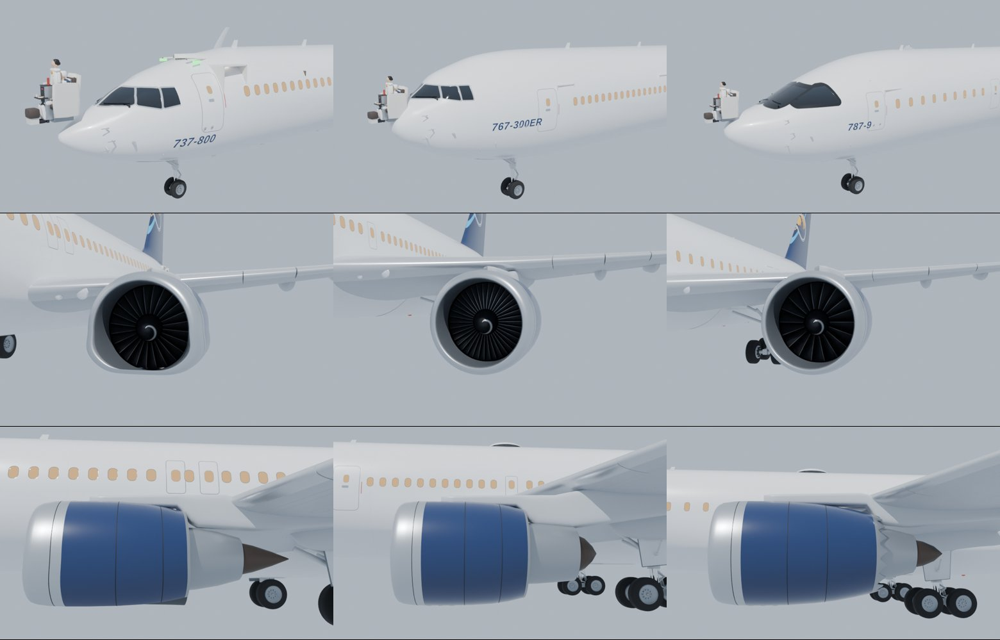

  機首・窓・エンジンの形は Wikimedia Commons の実機写真から寸法を読み取って合わせています（写真へのリンクは `docs/SPECS.md`）

### 1b-2. Boeing 747-400 / ATR 72-600（`AC_TYPE=b744` / `at76`）
* **747-400「ジャンボ」**：三面図と実機写真から計測した機首・2 階席のこぶ（アッパーデッキ、2 階の窓列と 2 階ドア）・窓列とドア位置・反り上がった尾部、4 発の CF6-80C2B5F、カント付きウイングレット、主翼ギア 2 本＋胴体ギア 2 本の 16 輪、6 枚窓のコックピット。客室は機首 2-2・アッパーデッキ前の J 2-3-2・Y 3-4-3。登録記号 JA744C
* **ATR 72-600**：高翼・T 尾翼のターボプロップ。6 枚羽根のプロペラ（PW127M）、胴体脇のスポンソン（主脚収納部）、2-2 の 70 席。登録記号 JA72AT
  * 飛行特性もプロペラ機用：推力は速度とともに落ち（出力一定）、アイドルではプロペラが空気ブレーキになる。巡航は FL200・約 275 kt（自動操縦の巡航高度も FL200 まで、速度は Vmo 250 kt 以下に制限）
  * エンジン音はプロペラの 120 Hz のうなり（翼端通過音とその倍音）中心で、ジェットの轟音は控えめ
* 4 発機は左右 2 基ずつを 1 つのエンジンとして飛行計算（推力は 2 基分）。4 基すべてのファンが回り、巡航では 4 本の飛行機雲、外側エンジンも接地・衝突判定あり。音は 2 基分の厚み
* 胴体ギア・3 軸ボギーの車輪や 4 基のファンは AI 機でも動作

### 1c. オリジナル機種 Micomsoft MA-300 / MA-700 / MA-900（`AC_TYPE=ma3` / `ma7` / `ma9`）
実在しない「夢の旅客機」3 機種。同じ `build_b787.py` で、寸法・主翼・エンジン・客室の数値だけを変えて生成しています（787 型の滑らかな機首と 4 枚窓、レーキドチップ）。

| | MA-300「Tsubame」 | MA-700「Hayabusa」 | MA-900「Ōtori」 |
|---|---|---|---|
| 位置づけ | 次世代の単通路機 | 高速の長距離双発機（Mmo 0.93） | 超大型の 4 発ワイドボディ |
| 全長 / 全幅 | 44.2 m / 46.0 m | 68.6 m / 64.4 m | 76.4 m / 74.8 m |
| 胴体幅 | 4.10 m | 5.85 m | 7.05 m |
| 主翼 | 後退角 27°・高アスペクト比 | 後退角 39°・鋭いレーキドチップ | 75 m 級・翼面積 590 m² |
| エンジン | ギヤードターボファン（ファン 18 枚） | シェブロン付き高バイパス（16 枚） | 小型の高バイパス MX-6 × 4 基（18 枚） |
| 客室 | 2-2 / 3-3、186 席 | 2-2-2 / 2-3-2 / 3-3-3、346 席 | 2-2-2 / 2-4-2 / 3-4-3、420 席 |
| 最大離陸重量 | 86 t | 285 t | 362 t |

  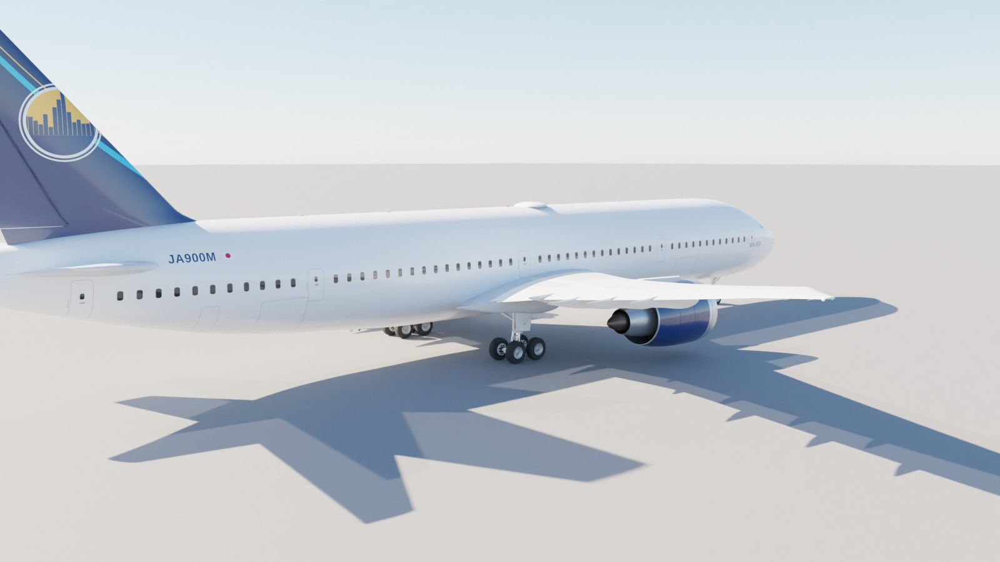

#### MA-W8「Ootaka（大鷹）」— 8 発エンジンの長距離機（`AC_TYPE=maw`）
* 胴体と主翼は **Airbus A340-600 の三面図から計測**（全長 75.30 m・胴体径 5.64 m・全幅 63.45 m、エアバス型の丸い機首と 6 枚窓、主翼上の非常扉を含む 4 組のドア、窓列、上に反り上がった尾部）
* エンジンは小型ターボファン MX-2 を **8 基**：B-52 のような 2 基 1 組のポッドを片翼 2 か所ずつ。飛行計算では片側 4 基を 1 つのエンジンとして扱い（推力は 4 基分）、ファンは 8 基とも回転、巡航では 8 本の飛行機雲
* 客室はビジネス 2-2-2・エコノミー 2-4-2 の 388 席
* 主脚は **1 本 8 輪**（4 軸 × 2 輪の長いボギー、`AXLES=4`）を左右に 1 本ずつ、前脚 2 輪と合わせて 18 輪

  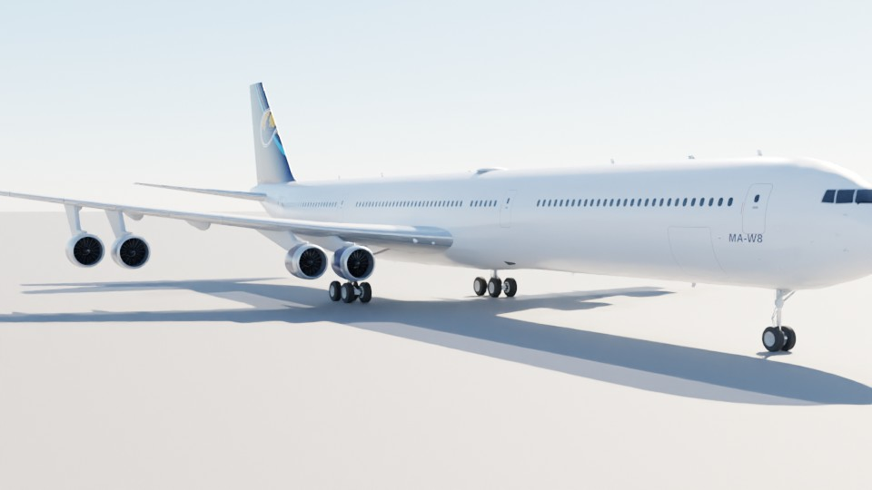

* メニューの機種選択に追加。AI 機としても飛びます（ボーイング 3 機種の約半分の頻度）
* 飛行試験（`AC=ma-300` など）・自動操縦フライト・緊急着陸テストで確認済み

* AI 交通の機種は毎回ランダム（機種が偏らないようシャッフルした順に割り当て）（767・787・747 など MTOW 136 t 超は無線で "heavy" を付けて交信）。駐機位置は機種ごとに前脚の停止位置をそろえ、ケータリング車・ベルトローダー・給油車・タグの位置もドアと貨物ドアの位置から決定

### 2. 実在の地理と 4 空港（`blender/geo.py`, `city_gen.py`, `real_kit.py`）
* **東京（羽田）・大阪（関西）・札幌（新千歳）・沖縄（那覇）**：海岸線・湾・島・山（富士山・六甲・丹沢・支笏湖周辺・やんばる等）を実際の緯度経度から多角形で作り、空港間の距離だけを縮めて実際の方位に配置（関西は西南西 260 km、新千歳は北北東 330 km、那覇は南西 420 km）。関西空港・羽田 D 滑走路・那覇の第 2 滑走路は周りを海に囲まれた埋立地（護岸つき）、沖縄本島の周りにはサンゴ礁の浅瀬、津軽海峡で北海道は本州と分離。地形は JS とシェーダーで同じ式（`web/js/terrain.js`、データは `geo.py` が書き出す `geo_data.js`）
* **起伏のある地形**（`web/js/terrain.js`, `world.js`）：侵食地形風のフラクタル（勾配で振幅を抑える fbm、JS の当たり判定とシェーダーで同じ式）で、内陸の丘陵と山脈（尾根・谷・沢筋）を生成。富士山などの円錐火山・都市・空港・ランドマークの高さは保護。カメラ中心の高密度グリッドに加え、グリッドで表せない細かい起伏はピクセル単位の法線で描画。地表は **Poly Haven（CC0）の航空写真スキャン**（草地・乾いた草・岩・高山帯・裸地・畑・砂浜・雪）と生成した樹冠テクスチャをテクスチャ配列（`assets/terrain_layers.jpg`、`tools/build_terrain_layers.py`）にまとめ、3 段階のスケールを回転させて重ねてタイルの繰り返しを消します。森林は標高と傾斜に応じて森林限界（本州 約 2,450 m、北海道 約 1,450 m）まで広がり、その上はハイマツ帯・ガレ場、急崖だけが岩肌、10 月の設定で標高 1,100 m 付近から紅葉。太陽の向きに応じた起伏の陰影で、上空からも山の立体感が分かります
* **場所ごとの磁針路**：各空港の主滑走路をシミュレーターの x 軸に沿わせたまま、空港ごとに「北」の向きを持たせ、その間を連続的に補間（`northAt`）。そのため羽田 34R/16L・関西 06R/24L・新千歳 01R/19L・那覇 36R/18L がすべて実際の方位で表示され、PFD・ND・ATC・ILS・自動操縦・太陽の方位（空港の緯度も反映）が一致
* **都市**（`city_gen.py` → `cityN.bin`、`web/js/cityscape.js` でインスタンス描画）：東京 62,000 棟（丸の内・新宿・渋谷・汐留・品川・みなとみらい・幕張などの超高層街区）、大阪 26,000 棟（梅田・難波・天王寺・中之島・神戸）、札幌 16,000 棟（碁盤の目の街路、雪国の切妻屋根）、那覇 14,000 棟（白いコンクリートと屋上の貯水タンク）。建物の種類・高さ・屋根は街区ごと、空港の制限表面より高い建物は置かない。25 m 以上の建物は当たり判定つき。地面には都市部の街区・道路・公園の陰影
* **ランドマーク**（`real_kit.py`、地形の高さに設置）：東京スカイツリー（634 m、展望デッキ・ライトアップ）、東京タワー、レインボーブリッジ、横浜ランドマークタワー、横浜ベイブリッジ、アクアライン（海ほたる・風の塔）／あべのハルカス、梅田スカイビル、大阪城、りんくうゲートタワー、スカイゲートブリッジ（関空連絡橋）、コスモタワー、明石海峡大橋／さっぽろテレビ塔、JR タワー、時計台／首里城、ゆいレール
* **発着数**：AI 機の行き先は羽田からの実際の路線シェア（新千歳 46%・那覇 32%・関西 22%）、ターンアラウンドは各空港の規模に合わせる（`geo.py` の `TRAFFIC`）
* **全滑走路の運用**（`blender/ops_layout.py` → `web/js/ops.js`）：各空港のすべての滑走路を使用。羽田は C 滑走路（従来の管制・交通）に加えて A 滑走路・D 滑走路に着陸、B 滑走路から離陸。関西・新千歳・那覇は第 2 滑走路で離着陸、メイン滑走路からも離陸（羽田便と共用）。滑走路どうしは交差せず、すべて誘導路でつながり、誘導路は滑走路を横切らない（滑走路端を回る迂回誘導路。関空は 2 島の間を結ぶ）。到着と出発が正面衝突しないよう誘導路は一方通行の流れで運用し、滑走路は常に 1 機ずつ（着陸機が近いと出発は停止線で待機、先行機が離陸滑走中なら後続は滑走路に入って待機）。地上では前方の機体との間隔を保ちます
* **便数とターミナル**：羽田に A 滑走路に面した第 2 ターミナル（全長 2.3 km、アーチ屋根、26 スポット・ボーディングブリッジ付き、中央に大屋根のメインホールと出発車寄せ）、関西は 1.7 km ウイングの両端と第 2 島の第 2 ターミナル（24 スポット）、新千歳・那覇はメインピアを全長 2.4 km に延長（各 +14 スポット）。管制塔・格納庫・貨物地区はピアの外側へ移設。便数は従来の 3 倍以上（空港ごとの発着規模に合わせた間隔で到着が続き、ターンアラウンド後にプッシュバックして出発）。夜はターミナルのガラス面が一晩中明るく点灯
* **尾翼のロゴライト**：夜間は水平尾翼上面のロゴライトが垂直尾翼を下から照らし、尾翼のロゴが浮かび上がります（AI 機は駐機中も点灯、自機は LOGO スイッチ連動）

### 2a. 東京・羽田空港（`blender/build_world.py`）
* **C 滑走路 34R/16L**（3,360 × 60 m、ICAO 標示：ピアノキー・指示標識（L/R つき）・接地帯・目標点・中心線・縁線）、**A 滑走路 34L/16R・B 滑走路 04/22・D 滑走路 05/23（海上の埋立島、連絡誘導路）**、平行誘導路・高速脱出誘導路、ホールディングポジション、エプロン、**14 スポットのボーディングブリッジ**付きアーチ屋根のターミナル、高さ 116 m の管制塔、整備ハンガー、貨物地区、燃料タンク、消防署、駐車場、ホテル、ILS（ローカライザー・グライドスロープ）、PAPI、進入灯
* **詳細な空港建築キット（`blender/airport_kit.py`）**：両空港のターミナル・ブリッジ・管制塔・格納庫はこのキットで生成。カーテンウォール（方立・無目・床スラブ）、エプロン階のシャッター付きサービスフロア、ウェーブ屋根と庇の柱、屋上設備。**ボーディングブリッジ**は固定通路 → 支柱付きロタンダ → 2 段の伸縮トンネル（窓帯・リブ）→ 車輪付き駆動脚 → 機体ドアに向いたキャブ（蛇腹）と点検階段まで作り込み、各スポットの 787 L1 ドアに接続。ゲート階段室・駐機誘導表示板（VDGS）・ゲート番号、管制塔（事務棟・リブ付きシャフト・傾斜ガラスの八角形キャブ・キャットウォーク・アンテナ・レドーム）、格納庫（かまぼこ屋根（リブ・換気塔）・分割扉・事務棟）。空港名は建物に焼き込まず、書き出したアンカー位置にシミュレーターが描画
* 灯火データ（滑走路灯・誘導路灯・進入灯の連鎖フラッシャー・**見る角度で色が変わる PAPI**・街路灯）を `world.json` に出力

### 2b. 関西・新千歳・那覇（`blender/build_airport2.py --id 2|3|4`）
* **関西（RJBB）**：2 つの人工島（06R/24L 3,500 m・06L/24R 4,000 m、島を結ぶ連絡誘導路）、レンゾ・ピアノ設計を模した全長 1.7 km の曲面屋根のウイングと翼断面の屋根が陸側へ高くなる本館、高さ 86 m の管制塔、スカイゲートブリッジでりんくうへ
* **新千歳（RJCC）**：01R/19L・01L/19R（各 3,000 m）、アーチ屋根の国内線ターミナルと国際線ターミナル（連絡通路）、防風林
* **那覇（ROAH）**：36R/18L 3,000 m と沖合の埋立地の 36L/18R 2,700 m、ヴォールト屋根のターミナルと国際線棟、高さ 88 m の管制塔、ヤシ並木と赤瓦の車寄せ門
* 共通：ICAO 標示（実際の滑走路番号）・滑走路灯・中心線灯・進入灯・連鎖フラッシャー・PAPI、平行誘導路と 3 本の取付誘導路（誘導路灯・停止線灯・案内標識）、7 スポットすべてにボーディングブリッジ（スポット番号は B / C / D）、整備格納庫、消防署、貨物上屋、立体駐車場、投光照明塔、吹流し、ILS、ブラストフェンス
* ランドサイド：出発車寄せ・中央分離帯（バス／タクシー乗り場の上屋・並木）・周回道路・アクセス道路・平面駐車場と立体駐車場の駐車車両・街路灯
* 出力：`web/assets/airportN.glb` と、スポット・看板位置・灯火・当たり判定・樹木の `airportN.json`（各空港の中心を原点とする座標、配置は `web/js/airports.js`）。モデルはカメラが 70 km 以内に近づいたときに読み込み

### 3. 地上支援車両（`blender/build_gse.py`）
* 10 車種：トーバーレス・プッシュバックタグ、手荷物トーイングトラクター、ULD ドーリー＋LD3 コンテナ、幌付き手荷物カート、ベルトローダー（ベルトが貨物ドアの高さまで上昇）、ケータリング車（シザーリフトで荷台が上昇し前部プラットフォームが展開）、給油車（JET A-1 タンク、昇降デッキ）、FOLLOW ME カー（点灯サイン）、運航用バン、ランプバス
* タイヤは個別オブジェクトで回転・前輪が操舵、回転灯・前照灯・尾灯が点灯
* 出力：`web/assets/gse.glb` と寸法・連結点の `gse.json`

### 4. 空港の交通と管制（`web/js/traffic.js`, `path.js`, `atc.js`）
* **駐機機が管制の指示で飛ぶ**：Ground にプッシュバックを要求 → 許可後にタグが前脚をくわえてプッシュバック（エンジン始動）→ 「滑走路 27 の停止位置まで Alpha 経由でタキシー」→ 停止線で待機 → Tower の「滑走路に入って待機」「離陸許可」→ 離陸・脚上げ → 場周経路（アップウインド・クロスウインド・ダウンウインド・ベース・ファイナル、バンク角は速度と旋回半径から計算）→ 着陸許可 → 3° のパスで進入・フレア・接地（タイヤスモーク）→ 誘導路へ離脱 → Ground の指示でスポットへ → 到着後にターンアラウンド → 次のフライトへ
* **管制の判断**：滑走路の占有（AI 機・プレイヤー機）、着陸機の到着予定時刻による離陸待機、前の着陸機との間隔によるダウンウインド延長、滑走路が空かなければゴーアラウンド、エプロン誘導路は 1 機ずつ（到着機優先）。無線のやりとりは画面左に表示し、英語の音声で読み上げ（送信の開始・終了のスケルチ音と帯域を絞ったガリガリ雑音を Web Audio で重ねて VHF 無線風に。Web Speech API、メニューまたは 9 キーで ON/OFF）
* **地上車両が自律走行**：両端の車両置き場から左側通行のサービス道路を走り、到着機にベルトローダー・手荷物カート列・ULD 列・ケータリング車・給油車が順に横付けして作業（リフト上昇など）、終わるとバックして離れ車庫に戻る。牽引カートは連結点に追従（トレーラー軌跡）。前方の車両や動いている航空機を検知して減速・停止
* プレイヤー機も障害物・滑走路占有として扱われる（滑走路上にいれば AI は待機・ゴーアラウンド）
* 使用滑走路は風向で決定（27 / 09）。**B キー**で AI 機・車両を追いかけるカメラ（押すたびに対象切替）、メニューで交通の ON/OFF

### 5. フライトシミュレーター（`web/`）
* **6 自由度剛体（240 Hz 固定ステップ）**：迎角/横滑り角・マッハ・地面効果・フラップ/スポイラー/脚の空力、失速と失速後特性、ISA 大気
* **GEnx-1B エンジン**：N1 スプール遅れ、推力の高度・マッハ減衰、逆噴射、燃料消費
* **降着装置**：ばね・ダンパー、タイヤ摩擦、ブレーキ（アンチスキッド相当）、前輪ステアリング、プッシュバック
* **フライ・バイ・ワイヤ**（787 風）：飛行経路角保持＋オートトリム、ロールレート指令＋バンク保持、エンベロープ保護（失速・過速・バンク・ピッチ）、ヨーダンパー、推力非対称補償
* **オートパイロット/オートスロットル**：HDG / ALT / V/S / FLCH / LOC / G/S、**オートランド（フレア・RETARD・ロールアウト）**、オートブレーキ、グラウンドスポイラー
* **グラスコックピット**：PFD・ND・EICAS、共形 HUD（FPV・ピッチラダー・ILS）、MCP パネル
* **警報とコールアウト**：V1・ROTATE・電波高度（2500〜10）・MINIMUMS・RETARD・GPWS（SINK RATE / PULL UP / TOO LOW GEAR…）・スティックシェイカー・オーバースピード・A/P 解除音
* **描画**：大気散乱の空と太陽の日周運動、環境マップ反射、影、GPU 地形（物理と同一の高さ関数）、波のある海と川、雲（晴れ〜曇天・雨）、**ボリュメトリック雲**（高品質時：3D Perlin-Worley ノイズのレイマーチ、多重散乱・前方散乱、深度を考慮した合成、曇天時は切れ目のない雲底と雲中の視程低下 — `web/js/clouds.js`）、**雨**（カメラ相対速度で傾く雨筋、窓ガラスの水滴が速度で後方へ流れる、雨音）、**濡れた滑走路**（水たまり・鏡面反射・灯火の縦長の映り込み、タイヤとエンジン後流の水しぶき、制動力低下、降り止んだ後は徐々に乾く）、**翼端渦・フラップ端渦とオーバーウイング・ベイパー**（湿度・迎角・フラップ・速度に応じて発生 — `web/js/vapor.js`）、夜の街明かり、**主翼のたわみ（揚力に応じて翼端が数 m しなる）**、タイヤスモーク、飛行機雲
* **フレーム生成**（`web/js/framegen.js`）：表示リフレッシュ 2 回に 1 回は描画せず、直前の描画を**今の姿勢に再投影**して作ります（VR の位置タイムワープ / ASW と同じ方式）。シミュレーションとカメラは毎回進むので、生成フレームでも視点の動きは遅延ゼロです。深度から各ピクセルを 3D に戻し、**オブジェクト ID パス**（各物体の自前マテリアルを複製して ID を出力するので、主翼のたわみ・窓の切り抜き・乗客のバリエーションも描画と完全に一致）で自機（外装・コックピット・客室）、AI 機、地上車両に剛体運動を与え、静止した世界と別々に動かします。2×2 ピクセルごとのグリッドメッシュを深度テスト付きで変形し、動く縁の後ろに現れる背景は背景側の色で補完、画面端は回転のみの再投影で埋めます。HUD や各ウィンドウは DOM なので生成の影響を受けません。設定「フレーム生成」：自動（描画がリフレッシュに追いつかない時だけ ON、時々 OFF を試して戻る）/ ON / OFF、Shift+G で切替、フライト情報に「FG 描画→表示 fps」を表示。
* **物理ベースの大気**（`web/js/atmo.js`、Hillaire 2020 方式）：レイリー・ミー散乱とオゾン吸収、球体の地球、多重散乱。透過率 LUT・多重散乱 LUT・天空 LUT（毎フレーム）から空を描き、同じ LUT で**空気遠近**（シーン全体の内散乱と減衰、深度から）をかけます。地表付近の霞（ミー散乱、スケールハイト 1.2 km）は天候の視程に従い、太陽光の色と強さも同じ大気の透過率から（正午は白、夕方は金色から赤）。巡航高度では濃い青の天頂と地平線の白い帯。遠くの雲も本物の空の色に溶け込みます。
* **丸い地球と地平線**：15 km より先の地形・海は地球の曲率で下がり、地形グリッド（±70 km）の外側には地形関数から焼いた陸と海の**遠景リング**が地平線の先（約 460 km）まで続くので、巡航中も四角い世界の端が見えず、海岸線が霞の中へ続きます。
* **雲の影**：ボリュメトリック雲から真上からの透過率マップを作り、地面・海・機体に雲の影が流れます。
* **自動露出（目の順応）**：HDR 画像の対数平均輝度（ミップチェーン）から GPU 上で露出を順応（暗い所へは約 1 秒、明るい所へは速く）。昼のコックピットや夜の客室は見やすく、雪原や雲の上は抑えめに。
* **人物と布の質感**：肌は皮下散乱の赤み（影側・耳や鼻）と柔らかな艶、髪は毛流れに沿った Kajiya-Kay ハイライト（白い一次と髪色の二次）、シャツ・座席生地・カーペットは斜めから見た繊維の光沢。地形は森の縁・岩肌・ガレ場・雪・砂浜の境界がテクスチャの起伏に沿って入り組みます（高さブレンド）。
* **損傷と火災**（`flightmodel.js`, `mishap.js`, `fx.js`）：主翼・エンジン・尾翼・胴体の各部位が地面/建物（`world.json` の障害物ボックス）との接触を個別に判定。ぶつけた場所が欠損（シェーダーで切り落とし、破片が飛ぶ）または炎上し、火災ベル・マスターウォーニング・EICAS 表示が作動。揚力/ロール/抗力/安定性/推力の非対称と燃料漏れが飛行特性に反映され、Shift+X で消火。
* **緊急事態（メーデー / パンパン）**（`playeratc.js`, `emergency.js`）：損傷・故障があると ATC ボタン（Y）が「メーデー宣言 / パンパン宣言」になり、宣言すると管制官が応答（スコーク 7700・最終進入へのレーダー誘導・即時着陸許可）、全局に「緊急事態発生・出発機は待機」を放送し、AI 機の離陸と着陸を止めて滑走路を空けます。飛行中の空港の消防署から赤い空港化学消防車 3 台（点滅灯つき）が滑走路脇の接地帯で待機、着陸後は機体を追って周囲を囲み、放水で火災を消します（約 15 秒）。火が消えて 45 秒後に「安全確認・滑走路再開」。宣言しないまま損傷があると 20 秒後に管制が「緊急事態を宣言しますか？」と確認、他空港に向かうと宣言が引き継がれ、主翼損傷や両発停止で低高度になると客室に「頭を下げて！」。**訓練用の故障**：Shift+E（ランダム）または一時停止画面のボタン（エンジン火災 / エンジン停止 / 燃料漏れ / **主翼脱落**（外翼30%が脱落・炎上） / **両エンジン停止**）。**消防・救助と脱出**（`emergency.js`、モデルは `blender/build_arff.py` → `arff.glb`：6輪の空港化学消防車〈キャブ屋根の放水銃・バンパー放水銃・赤青の回転灯・「空港消防 AIRPORT FIRE」の文字〉、耐熱服の消防隊員、乗客、2レーンの脱出スライド）：接地すると消防車は滑走路脇を全速力（約120 km/h）で機体に並走し、停止後は主翼端を回り込んで機首の左右前方と正面の攻撃位置へ。放水銃は放物線を描く水流で火点を狙い（火がなくても停止直後はブレーキに泡）、各車から隊員2名が降りて火点や脱出スライドの下へ歩いて向かいます。宣言していなくても損傷したまま着陸すると管制が消防を出します。緊急着陸で停止すると機長が脱出を指示し、火災と反対側の全ドアで脱出スライドが膨らみ、乗客がスライドを滑り降りて機体から約70 m離れた集合場所へ走ります（停止時に乗員がパーキングブレーキをセット、客室の乗客モデルはドアから出た人数に合わせて減っていきます）。ターミナルから救援バス（定員60名、GSE のランプバス）が集合場所の横に着き、乗客が歩いて乗り込み、満員か全員乗車でターミナルへ戻ります。全員の輸送が終わり滑走路が再開されると消防車も消防署へ戻ります。空港内で墜落した場合もクラッシュアラームで消防車が残骸に向かい放水します。**全自動緊急着陸**：宣言後にもう一度 Y（または Shift+L）で、乗員が最寄り空港の使用滑走路へ全自動で着陸（`AutoFlight.emergency`：エンジン火災チェックリストで消火、滑走路の手前に居れば直接 ILS、通り過ぎていればダウンウインド経由で 45° 会合、周辺の山は予測経路の地形から最低安全高度を計算して回避、主翼損傷時は最小操縦速度・フラップ制限・バンク 12° 制限・長めのファイナル・最大オートブレーキ）。メニューの自動操縦フライト中に故障が起きると乗員が自動で宣言して最寄り空港へ引き返します。**両エンジン停止時**（`AutoFlight.deadstick`）：スペースシャトルの着陸誘導と同じ「ヘディング整列円（HAC）」方式で滑空（新設の GLIDE モードで最良滑空速度 200 kt をピッチで保持、滑空比は約19）。最寄り空港の両方向・円の左右から、地形と建物を避けつつ届く組み合わせを選び、円に接線で入って旋回し滑走路延長線にぴったり整列、6.3°の急角度最終進入をフラップ20＋脚＋スピードブレーキで調整し、降下率に応じて早めに引き起こして接地します。高すぎれば最終進入を長くとりスピードブレーキを使います。滑空で届かないときは乗員がエンジン再始動を試み、1基が再始動したら片発の緊急着陸に切り替えます（燃料切れ・火災・脱落したエンジンは再始動不可）。**建物への衝突**：飛行中に翼端・エンジン・尾翼が建物に当たると（胴体が当たれば墜落）数秒で管制が「建物への衝突を確認、緊急事態を宣言しますか？」と呼び掛け、地上走行中に建物に接触するとグラウンドが停止を指示して消防車が点検に来ます。空港内（5 km 以内）で墜落した場合はクラッシュアラームが放送され、消防車が残骸へ急行して放水します。**AI 機の緊急事態**：時々到着機がパンパンを宣言（エンジン故障・油圧故障・客室の煙・バードストライク・急病人）して優先着陸し、同じく消防車が出動します。

  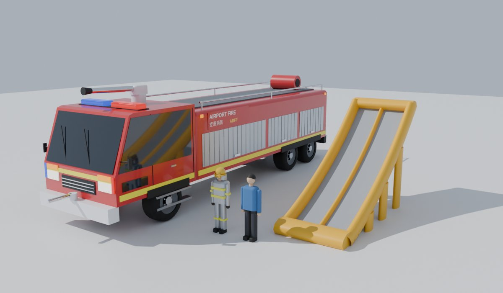
  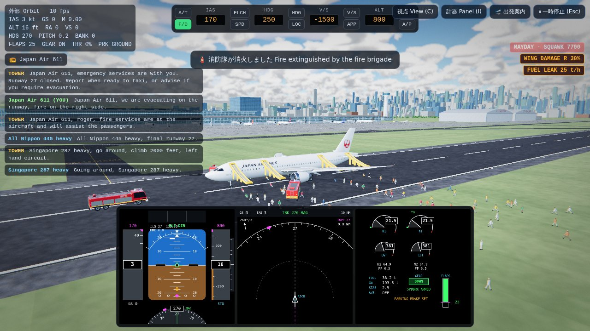

* **墜落演出**：爆発・火球（光は数秒かけて膨らみ消える、画面の点滅や暗転・墜落メッセージは無し。Esc でやり直し/メニュー）、胴体が前/中/後部に分断され主翼・エンジン・脚・尾翼がばらばらに飛び散り（剛体運動・地面バウンド）、各破片と燃料プールが炎上・黒煙を上げる。海では水蒸気。
* **表面の質感**（`shading.js`）：機体の汚れ・筋状の汚れ・艶のムラ・排気のすす、地上車両の泥はね・塗装剥げ、ビルの外壁ごとの色差・雨だれ・足元の汚れ・夜間の窓の点灯のばらつき、市外の畑・生け垣のパッチワーク。
* **ロゴの出典**：npm パッケージ `@steyng/airline-logos`（Soaring Symbols）の SVG をアートワークに合わせて切り抜き（`web/js/airlinelogos.js`, `airlinelogos2.js`）。商標・著作権は各航空会社に帰属。
* **プッシュバック**：J で最寄りの GSE 基地から黄色いトーイングカーが前脚まで来て連結 → 押し出し（Q/E で操向）→ もう一度 J で切り離し、トーイングカーは基地へ戻る。JAL 塗装では押し出し開始と同時に全座席モニターで機内安全ビデオを音付きで上映（`assets/jal_safety.mp4` / `.webm`）。音は客室内で最大、コックピットではわずか、機外ではこもって聞こえ、カメラが約 80 m 離れると聞こえなくなる。
* **関西・新千歳・那覇との往復便**（`web/js/airports.js`, `airport2.js`, `traffic.js`）：AI 機は出発のたびに羽田からの路線シェアで目的地を選び（出発案内板にも表示）、巡航して着陸 → スポットへ地上走行 → 駐機・地上サービス → プッシュバック → 離陸して戻り、羽田に直線進入で着陸。到着空港では羽田側から進入する向きの滑走路を離着陸とも使用します。
* **各空港の地上車両・管制**：各空港に車両基地（トーイングカー・ケータリング・給油車・ベルトローダー）があり、駐機した AI 機へサービスに向かい、出発前にはトーイングカーがプッシュバック。各空港の Tower / Ground との交信（着陸許可・地上走行・プッシュバック・離陸許可、実際の滑走路番号で）。
* **空港ごとに独立した無線**：4 空港それぞれに別の Tower / Ground。無線は自機に最も近い空港の周波数に切り替わり（切替時に通知）、その空港の管制と交通だけが聞こえます。プレイヤーの要求（プッシュバック・タキシー・離陸・着陸・スポットへ）も、その空港の滑走路・誘導路・スポット・交通状況で処理され、関西・新千歳・那覇でプレイヤーが滑走路の許可を得ている間は AI 機が離陸を待ちます。
* **出発案内・到着案内**（Shift+D / Shift+A または右上のボタン）：成田・羽田風の黒い案内板（時刻・行先／出発地・便名・搭乗口・備考、日本語と英語が数秒ごとに切り替わる、航空会社マーク付き）。4 空港をタブで、出発／到着をボタンで切替。AI 機の実際の駐機・出発状況、飛行中の便の残り距離（到着予定時刻）から生成されます。
* **自動プッシュバック**（`web/js/pushback.js`）：J を押すとトーイングカーが連結し、機体を押し出して誘導路（タキシーレーン）に沿う向きまで自動で回し、止まって切り離し。P でブレーキ解除して地上走行へ。
* **機内を歩く**：視点「機内を歩く Walk」で WASD / 矢印で移動、Q/E で向き、ドラッグで見回し、Shift で早歩き。通路・ギャレーは自由に、座席の列は通り抜けられません。
* **無線ノイズ**：フライト設定で ON/OFF。
* **空港名と目的地**：フライト設定で 4 空港の名前と目的地を設定。空港名はターミナル・格納庫の看板、ATC の呼出し（◯◯ Tower / Ground）、出発案内板、機内マップ、**地上車両の社名表示**（◯◯ GROUND SERVICES・給油車・ケータリング車、空港ごと）に反映。目的地は機内エンタメの地図（出発地・目的地・残り距離）、自動操縦フライト、目的地ファイナルのシナリオに使われます。
* **自動操縦フライト**（シナリオ「自動操縦フライト」、`web/js/autoflight.js`）：出発空港の使用滑走路から目的地まで全自動。離陸（フラップ 5・離陸推力・センターライン維持・VR で機首上げ・ギア上げ）→ 800 ft で A/P・A/T → 経路に沿って上昇（フラップ格納、10,000 ft 以下 250 kt）→ 距離に応じた巡航高度 → 降下開始点から 3,000 ft へ降下（減速・フラップ）→ 進入フィックスで ILS（LOC/GS 捕捉、ギア・フラップ 30、Vref+5）→ 自動着陸 → 逆噴射・オートブレーキで停止。操縦桿を動かすと手動に切り替わります（`tests/autoflight_test.mjs` で全経路を検証）。
* **建物の当たり判定**：ビル・ターミナル・格納庫・燃料タンク・管制塔・橋の主塔・港のクレーン等（`world.json` の障害物ボックス）。低速で当てると停止して損傷表示、速度があれば欠損・炎上・墜落。
* **視点**：コックピット（HUD）・追尾・外部・客室窓（窓側座席から翼のたわみが見える）・機内（通路）・管制塔・フライバイ・AI 交通（B で対象切替）
* **MSFS 2024 風の UI**：ホーム画面は全面写真の背景に上部ナビ（ホーム／設定・時計）、Cycles でレイトレースした壁紙を使った大きなモードタイル（矢印キーで移動、Enter で選択、Esc で戻る）。飛行中は機外の景色を主役に、画面上部のツールバー（マウスを動かすと表示、止めると隠れる）から計器パネル・オートパイロット・フライト情報・無線ログ・ATC 交信・視点・出発/到着案内・一時停止を開閉。各ウィンドウは暗いガラス調でタイトル帯つき、開閉状態はブラウザに保存（チュートリアル・初心者モードでは全部表示）
* **タイトル画面**：キービジュアル（`web/assets/title.jpg`）にロゴ・キャッチコピー・特長・スタートボタン。クリック / Enter / Space でメニューへ
* **メニュー**：最初に「モード」を選ぶ画面（初心者モード・フリーフライト・自動操縦の旅・着陸チャレンジ・緊急事態訓練・遊覧飛行・スポッター）。選んだモードに必要な設定だけが、コンパクトなスライドショー（フライト → 故障 → 機種 → 重量・塗装 → 環境 → オプション の中から）で開きます。どのモードにも最後に「オプション」（無線音声・無線ノイズ・サウンド・画質・交通・初心者モード・空港名）があり、モード画面の「⚙ 詳細設定」からも開けます（重量・塗装と一緒に）。オプションの選択はブラウザに保存。タッチ操作ではスワイプで切替
* **初回チュートリアル**（`web/js/tutorial.js`）：はじめて起動したときは、メニューの前に必ず実際に飛ぶ練習をします。滑走路 27 から離陸推力 → VR で機首上げ → ギア上げ → 1,500 ft まで上昇 → フラップ上げ → 30° の旋回 → オートパイロット、続いて 12 マイル手前から ILS 捕捉 → ギア・フラップ 30 → 自動着陸 → 逆噴射とブレーキで停止。各手順は実際の操作を検知して進み、墜落するとその段階の最初からやり直し。完了はブラウザに保存され、モード画面の「🎓 チュートリアル」からいつでもやり直せます
* **初心者モード**：管制・パイロットの無線（英語）すべてに日本語訳を表示（`web/js/atcja.js`、ICAO の定型句を句ごとに訳す）。画面下に「次にやること」をキー付きで案内（プッシュバック要求 → 地上走行 → 離陸準備完了 → VR で機首上げ → ギア・フラップ → 着陸要求 → ILS → フレア → 逆噴射）
* **シナリオ**：RWY27/09 離陸、ゲート 7 からプッシュバック、ILS 27 進入、ショートファイナル手動着陸、目的地ファイナル、自動操縦フライト、都市遊覧、FL350 巡航

## 操作 / Controls

| キー | 操作 | キー | 操作 |
|---|---|---|---|
| ↑ ↓ / W S | ピッチ（↓=機首上げ） | ← → / A D | ロール（地上では前輪操舵） |
| Q E | ラダー・前輪 | R F | 推力 +/− |
| Shift+R | TOGA | Shift+F | アイドル |
| H | 逆噴射（地上） | X / Z | フラップ下げ / 上げ |
| G | ギア | / または K | スピードブレーキ（DOWN→ARMED→FLIGHT→UP） |
| Space / . | ブレーキ | P | パーキングブレーキ |
| N | オートブレーキ | J | プッシュバック |
| 1 / 2 | A/P / A/T | 3 4 5 7 | HDG / ALT / V/S / FLCH |
| 6 | APP（ILS 捕捉を準備） | 0 | DIRECT 則（Home/End でトリム） |
| C | 視点切替 | I / U | 計器パネル / HUD |
| Shift+M | オートパイロット画面 | Shift+I / Shift+V | フライト情報 / 無線ログ |
| Shift+G | フレーム生成 自動 / ON / OFF | | |
| L | 着陸灯 | T | 時刻 +1 時間 |
| B | AI 交通カメラ（対象切替） | 9 | ATC 音声 ON/OFF |
| O | 地上サービス | Shift+X | 消火（火災ハンドル） |
| Shift+E | 故障発生（緊急訓練） | Y（損傷時） | メーデー / パンパン宣言 → 再度 Y で全自動緊急着陸 |
| Shift+L | 全自動緊急着陸 | | |
| Shift+D | 出発案内板 | 視点 Walk で WASD | 機内を歩く |
| Esc | 一時停止（操作方法を表示）/ 再開 | Backspace | リセット |

MCP の数値（IAS / HDG / V/S / ALT）はマウスホイールで変更、クリックで現在値に合わせます（Shift で 10 倍）。ゲームパッドにも対応しています。

**離陸のコツ**：Shift+R → VR（PFD 速度テープの緑の VR）で ↓ を 2〜3 秒 → 機首 12〜15° を保持 → 正の上昇率で G → 1000 ft 以上で 1 を押して A/P。
**着陸のコツ**：ILS シナリオで 6（APP）→ ギア G、フラップを 30 まで X で下げ、A/T の速度を Vref+5 に。50 ft で自動フレア、接地後は H で逆噴射。

## ビルド / Rebuild the Blender assets

```bash
pip install bpy pillow scipy numpy      # または Blender 4.x/5.x 同梱の Python
cd b787-flight-sim/blender
python3 build_b787.py                   # 787-9（テクスチャ生成 → .blend → .glb）
python3 build_b787.py --quick --lod     # 駐機機用 LOD
python3 build_b787.py --cabin           # 客室だけ再生成（<asset>-cabin.glb・cabin-protos.glb・メタデータ、AO の焼き込み込み）
AC_TYPE=b738 python3 build_b787.py      # 737-800（--lod も同様）
AC_TYPE=b763 python3 build_b787.py      # 767-300ER
AC_TYPE=b744 python3 build_b787.py      # 747-400（at76: ATR 72-600、ma3 / ma7 / ma9 / maw: MA シリーズ）
python3 geo.py                          # 地理データ → web/js/geo_data.js（地図は output/）
python3 city_gen.py 1 2 3 4             # 東京・大阪・札幌・那覇の建物 → web/assets/cityN.bin
python3 build_world.py                  # 羽田＋東京のランドマーク
python3 build_airport2.py --id 2         # 関西（--id 3 新千歳 / 4 那覇）＋ランドマーク
python3 build_gse.py                    # 地上支援車両
python3 render_previews.py aircraft     # Cycles プレビュー（docs/images）
python3 render_previews.py world
```

Blender アプリから使う場合：`blender --background --python build_b787.py`。

## 4K 壁紙 / Wallpapers

```bash
cd blender && AC_TYPE=b789 python3 render_wallpaper.py takeoff   # または landing
```
`blender/render_wallpaper.py` が機体の .blend に滑走路（標示をテクスチャに描画）・芝生・遠くの丘と空港ビル・雲・大気のもやを足して、Cycles のパストレーシングで 3840×2160 を書き出します（`dist/wallpapers/`）。takeoff は夕方の低い太陽の中で機首を上げた瞬間、landing は日没後のブルーアワーに着陸灯・航法灯・ストロボ・滑走路灯を点けた最終進入。`--res`・`--samples`・`--exposure` で調整。`--livery jal` / `--livery ana` でゲームと同じ JAL・ANA 塗装（胴体の帯・タイトル、垂直尾翼のロゴ、エンジン色）。塗装の素材はゲームの `livery.js` から `node tools/export_livery.mjs` で書き出します（web/ をポート 8787 で配信中に実行）。

## 単一 HTML 版 / Single-file build

```bash
npm i esbuild                       # 初回のみ
python3 tools/build_single_html.py --video-kbps 12   # → dist/MicomsoftFrightSimulator.html（約 31 MB）
```
JavaScript（three.js 含む）を esbuild で 1 本にまとめ、モデル・データ・テクスチャ・安全ビデオ・Draco デコーダーをすべて base85（`<` `>` `&` を含まない独自の 85 文字。base64 より 6 % 小さい）で埋め込んだ 1 ファイル。サイズを抑えるため、圧縮の効くものは gzip、関西・新千歳・那覇のモデルのテクスチャは world.glb と同じ画像なので除いて実行時に共有、4096 px を超える機体テクスチャと 4096 px の法線・ORM・発光マップ・客室壁は半分に縮小・JPEG 再圧縮、地形テクスチャ配列は 384 px タイル・タイトル画像は再圧縮、安全ビデオは `--video-kbps` で再エンコード（imageio-ffmpeg または ffmpeg）、`--no-video` で省略。サーバー不要で、ダブルクリックでブラウザ（Chrome / Edge / Firefox）で開けます。起動時に埋め込みデータをメモリ上の blob URL に展開し（`window.B787_ASSETS`）、`main.js` が fetch と three.js のローダーをそこへ振り向けます。

## テスト / Tests

```bash
node tests/flight_test.mjs
node tests/autoflight_test.mjs        # 自動操縦フライト 全経路
node tests/emergency_land_test.mjs    # 緊急自動着陸 7 位置 × 4 故障 + 両エンジン停止 8 位置（AC=b737-800 / b767-300er も可）
```
離陸・A/P 高度/方位/速度保持・FL350 巡航・ILS オートランド、自動操縦フライト、緊急自動着陸をグラフィック無しで検証します。

## ファイル構成 / Layout

```
b787-flight-sim/
├── blender/
│   ├── b787_geometry.py      787-9 / 767-300ER / 737-800 の寸法と形状関数（AC_TYPE で切替）
│   ├── build_b787.py         機体モデル生成（bpy）
│   ├── textures_b787.py      塗装・窓・パネルライン等のテクスチャ生成
│   ├── cockpit_b787.py       コックピットのパネル・スイッチ・座席（テクスチャ付きパネル）
│   ├── cabin_b787.py         客室
│   ├── build_gse.py          地上支援車両（タグ・給油車・ケータリング車など）
│   ├── geo.py                実在の地理（海岸線・山・都市・空港・滑走路・交通量）
│   ├── city_gen.py           都市の建物配置（東京・大阪・札幌・那覇）
│   ├── real_kit.py           副滑走路・ターミナル屋根・ランドマーク・ヤシ
│   ├── build_world.py        羽田空港（bpy）
│   ├── airport_kit.py        空港建築キット（ターミナル・ボーディングブリッジ・管制塔・格納庫など）
│   ├── build_airport2.py     関西・新千歳・那覇（--id 2/3/4）（bpy）
│   ├── textures_world.py     アスファルト・ファサード等のタイルテクスチャ
│   ├── render_previews.py    Cycles によるプレビューレンダリング
│   └── output/*.blend        Blender で開けるシーン（テクスチャ埋め込み）
├── web/                      シミュレーター（index.html + js/ + assets/ + vendor/three）
├── tests/flight_test.mjs     飛行モデルの自動テスト
└── docs/                     SPECS.md（寸法と出典）、images/
```

寸法と出典は [docs/SPECS.md](docs/SPECS.md) を参照してください。登録記号は架空のものです。空港と都市は実在の場所をモデルにした簡略化（距離は縮めてあります）で、航法には使えません。エアラインのロゴと塗装は実在各社のもので、権利は各社に帰属します。
