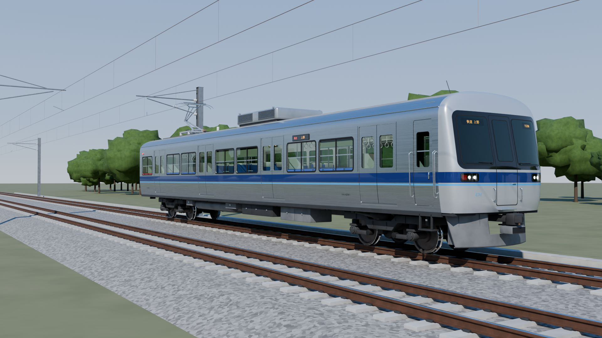

# JR東日本 E219系 近郊形直流電車（架空）― クモハE219-1 高精細Blenderモデル



2000年代初頭の JR 車両デザイン（E231系・E531系・313系・223系2000番台などの時代）の文法で
考案した **オリジナルの架空車両** です。実在の形式・社章・ロゴは使用していません。

## コンセプト

> 「2002年、首都圏近郊区間に投入された次世代の標準型近郊電車」

| 項目 | 内容 |
| --- | --- |
| 形式 | E219系 近郊形直流電車（架空） |
| モデル化した車両 | クモハE219-1（制御電動車・パンタグラフ付き） |
| 登場想定 | 2002年 |
| 車体 | 軽量ステンレス（ビードレス）、拡幅車体・裾絞り |
| 全長 / 車体長 | 20,000mm / 19,500mm |
| 最大幅 | 2,950mm |
| 屋根高さ | 3,620mm（冷房装置上面 4,000mm） |
| 床面高さ | 1,130mm |
| 側扉 | 片側4扉・両開き 1,300mm（車体断面に沿った曲面扉） |
| 前頭部 | FRP製 貫通形、ブラックフェイス、前照灯・尾灯を帯の中に一体化 |
| 前照灯 / 尾灯 | HID 2灯×2 / LED |
| 行先表示 | 3色LED（前面：運転台窓内上部、側面：幕板） |
| 集電装置 | シングルアームパンタグラフ（碍子4本支持） |
| 制御装置 | IGBT-VVVFインバータ（床下・冷却フィン付き） |
| 台車 | ボルスタレス・軸梁式・空気ばね（全軸駆動、踏面ブレーキ） |
| 冷房装置 | 集約分散式（屋根上1基・コンデンサファン2基） |
| 座席 | ロングシート＋セミクロスシート（ボックス席2区画）、車端部は優先席 |
| 連結器 | 前位：密着連結器＋電気連結器 / 後位：棒連結器 |
| カラー | 紺（ディープネイビー）帯 ＋ 水色（スカイブルー）細帯 |

### デザインの考え方

- **2000年代初頭らしさ**：ビードレスのステンレス車体、拡幅・裾絞り断面、黒い窓枠、
  前面のブラックフェイス、3色LED表示器、シングルアームパンタ、ボルスタレス台車、
  車端の転落防止幌、ロールカーテン付き側窓など、当時の標準装備を積み上げています。
- **オリジナル要素**：紺＋水色の2色帯を前面まで回し、前照灯・尾灯ユニットを紺帯の中に
  埋め込んだ「帯一体型ライトケース」としました。前面上部はわずかに後傾させ、
  平面形も緩くカーブさせて、角は超楕円で側面へ滑らかにつないでいます。

## ファイル

| ファイル | 内容 |
| --- | --- |
| `build_e219.py` | モデル生成スクリプト（車両・線路・架線・照明・カメラ・レンダリング設定をすべて手続き生成） |
| `e219_kumoha.blend` | 生成済み Blender シーン（Blender 4.2 以降 / 5.x で動作確認） |
| `e219_kumoha.glb` | 車両のみの glTF 2.0 書き出し（他ツール・ゲームエンジン用） |
| `renders/` | Cycles でレンダリングした画像 |

## 再生成・レンダリング

```bash
# Blender 本体
blender -b -P build_e219.py -- --render            # 生成＋全カメラをレンダリング
blender -b -P build_e219.py -- --render --preview  # 低解像度・低サンプルの試し描き
blender -b -P build_e219.py -- --render --only=front --only=bogie   # 一部のカメラだけ

# pip 版 bpy（Python 3.13 + `pip install bpy`）
python build_e219.py --render
```

カメラ: `hero`（外観3/4）, `side`（側面図・正投影）, `front_ortho`（前面図・正投影）,
`front`（前頭部アップ）, `bogie`（台車・床下）, `roof`（屋根上・パンタグラフ）, `interior`（室内）

## モデル構成（主なオブジェクト）

- **車体**：断面プロファイル（裾絞り＋超楕円の屋根）を押し出した外板・内板一体のシェルに、
  角丸の窓・扉開口をブーリアンで抜いています。帯は断面上の区間ごとにマテリアルを割り当てているため、
  ずれやZファイティングがありません。
- **前頭部**：`x = XB + g(y/w(z))·D(z)` の解析曲面をグリッド化。ブラックフェイス・前面窓・
  ライトケース・表示器などは、正面図上の形状をこの曲面に投影して貼り付けています。
- **台車**：車輪は実物に近い断面（フランジ・踏面勾配付き）を回転体で作成、軸箱・軸梁・コイルばね
  （らせん）・空気ばね・ヨーダンパ・主電動機・歯車箱・踏面ブレーキまで個別にモデリング。
- **パンタグラフ**：下枠・上枠の長さから膝位置を幾何計算し、架線高さ 5,100mm に接触した状態で配置。
- **室内**：ロングシート（バケット7人掛け）、ボックス席、袖仕切り、握り棒、つり革、荷棚、
  天井照明、扉上LED案内表示器、運転室仕切りなど。
- **環境**：50kgN 相当のレール断面、PC枕木＋締結装置、バラスト、複線、架線柱・シンプルカテナリ、遠景の樹木。

規模：車両のみで約 1,170 オブジェクト / 約 30 万ポリゴン（三角形換算）。
